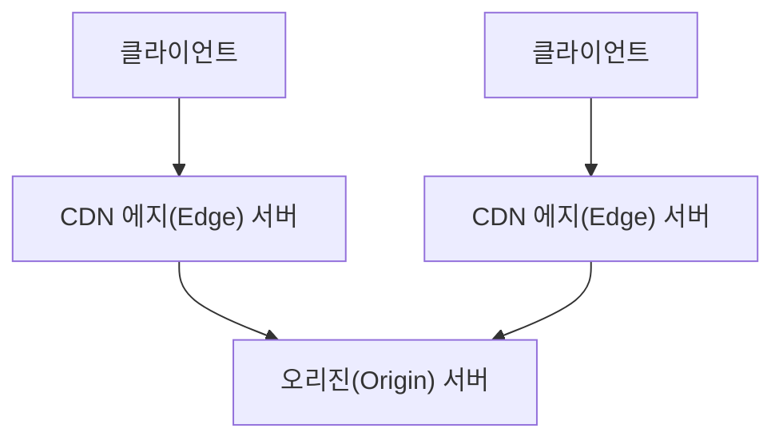

# 1장

### 문제 상황

신입 개발자 A가 내부 직원용 사이트를 개발하여 배포했으나, **DB 연결 오류**가 반복적으로 발생함.

### 원인 1

**DB 커넥션을 닫지 않아(반환하지 않아) 커넥션 풀의 커넥션이 모두 소진**됨.

→ 커넥션을 사용 후 close하지 않아서 커넥션 누수가 발생함.

### 원인 2

**커넥션 풀의 커넥션 최대 유지 시간 설정 미흡**

→ 풀에 남아 있는 커넥션이 DBMS의 커넥션 최대 유지 시간을 초과하면서 커넥션이 끊어짐.

→ 이로 인해 커넥션 풀에서 유효하지 않은 커넥션만 남고, DB 연결 불가 상태가 됨.

**추가 요약**

신입 백엔드 개발자가 자주 겪는 실수로, 커넥션 반환 누락과 커넥션 풀 설정 미흡이 대표적이다.

### 내가 겪었던 db connection pool 문제

회사에서 개발을 한창 하던 도중 커넥션 풀이 꽉 차서 db에 연결할 수 없는 문제가 있었다(개발환경에서도 테스트 데이터가 있어야 되는 상황이라 dev환경 db를 개발시에 모든 개발자가 붙여놓고 공통으로 사용)

개발을 빨리 해야 퇴근을 할 수 있는데 내 업무에 지연이 생기니까 조급해진 나는 코드를 뜯어보기 시작하였다…

일단 처음으로 눈에 들어온것은 new HikariDataSource()로 메서드 호출시마다 커넥션을 만드는데 close()가 안되는 거였다

### 나의 대처

자동 반환이 몇분인지 몇시간인지 알 수 없지만 조금이라도 빨리 close하면 내가 한번쯤은 연결되어 개발을 할 수 있을 것 같아 close()를 명시적으로 하는 코드를 작성해서 MR을 날렸다가 어차피 알아서 반환되는데 뭐하러 close()를 명시적으로 하냐고 MR 기각당했다

당시의 코드는 다음과 같은 형식이었다

```java
// 매번 새로운 DataSource 생성
private DataSource TenantCacheToDataSource(TenantCache cache) {
    HikariDataSource dataSource = new HikariDataSource(); // <- 새로 생성!
    // ...
}

// Migration에서 일회성 사용
public void updateSchema(String tenantCode) {
    DataSource dataSource = TenantCacheToDataSource(cache); // 새로 생성
    migration(dataSource, cache.getSchemaName());          // 한 번 사용
    // 끝! (close 안함)
}
```

나의 논리는 다음과 같았다

```java
// Close 안하면:
DataSource ds1 = new HikariDataSource(); // Pool 1 생성 (max 10개 conn)
migration(ds1, "tenant1");               // 사용 완료
// Pool 1이 10분~2시간 동안 Connection 10개 점유하고 있음

DataSource ds2 = new HikariDataSource(); // Pool 2 생성 (max 10개 conn)  
migration(ds2, "tenant2");               // 사용 완료
// Pool 2도 10분~2시간 동안 Connection 10개 점유

// 결과: 20개 Connection이 오랫동안 점유됨
```

```java
// Close 하면:
DataSource ds1 = new HikariDataSource();
try {
    migration(ds1, "tenant1");
} finally {
    ds1.close(); // Pool 1 즉시 해제, Connection 즉시 반환
}

DataSource ds2 = new HikariDataSource();
try {
    migration(ds2, "tenant2");  
} finally {
    ds2.close(); // Pool 2 즉시 해제, Connection 즉시 반환
}
// 결과: 실제 사용하는 순간에만 Connection 점유
```

- **풀링을 망치는 게 아님** (애초에 재사용 안하고 있음)
- **Connection 점유 시간을 대폭 단축**
- **일회성 작업에는 Close가 필수**

기각한 사람의 논리:

매번 close()를 호출하는 것은 데이터베이스 커넥션 풀링을 무의미하게 만들어 오히려 성능이 악화된다. 

절대 권장되지 않는다.

### HikariCP (데이터소스 풀)의 작동 원리

- **HikariCP는 미리 지정한 개수의 DB 연결을 생성하여 Pool안에 저장**
- 어플리케이션이 DB 연결이 필요할 때마다 새로 연결을 맺지 않고, 이미 생성된 연결을 **풀에서 꺼내서 사용**
- 사용을 마치고 `connection.close()`를 호출하면, 연결을 진짜로 닫지 않고 다시 풀에 반환

### 매 요청마다 DataSource 객체 생성 및 close를 호출하는 경우

- 만약 데이터 소스를 **매 요청마다 생성 → close 호출 → DataSource 객체 자체를 닫는다면**, 풀링의 모든 장점이 사라짐

```java

HikariDataSource ds = new HikariDataSource(...);
Connection conn = ds.getConnection();
conn.close(); // 풀 반환되나...
ds.close();   // 물리적 연결이 끊어져 풀링 효과가 완전히 무효화됨.
```

일반적인 풀링 방식을 쓴다면, `connection.close()`는 반드시 호출해야 한다

- 하지만 이때의 close는 물리적 연결 닫기가 아닌 풀 반환이다
- **DataSource 객체를 close 하는 것은 절대 매 요청마다 하면 안 된다**

지금 와서 다시 보면 맞는말임

하지만 Migration용 1회용 연결에 대해서는 어쩌다가 나도 맞지 않았나 싶음

내가 저지른 짓…

**`datasouceUpdate()` 메서드**

```java

dataSource = TenantCacheToDataSource(cache);
dataSourceConfig.addDataSource(cache.getCode(), dataSource);
// ...
finally {
    if (dataSource != null && !dataSource.isClosed()) {
        dataSource.close();// ❌ 왜이러는것임
    }
}

```

**`updateSchema(TenantCache tenantCache)` 메서드**

```java

dataSource = TenantCacheToDataSource(tenantCache);
migration(dataSource, tenantCache.getSchemaName());
dataSourceConfig.addDataSource(tenantCache.getCode(), dataSource);// 여기서 등록// ...
finally {
    dataSource.close();// ❌ 등록해놓고 왜 닫아버린단말임
}

```

그러나 이런 일회성 마이그레이션은 닫아주는게 더 좋지 않았을까 싶은…

```java
@Override
public void updateSchema(String tenantCode) {
    try {
        if (!tenantCode.equals(default_schema)) {
            TenantCache cache = getTenantCacheFromRedis(tenantCode);
            cache.setPassword(encryptAES256.decryptAES256(cache.getPassword()));
            DataSource dataSource = TenantCacheToDataSource(cache);
            migration(dataSource, cache.getSchemaName());
            schemaValidator(cache.getUrl(), cache.getUser(), cache.getPassword(), cache.getSchemaName());
        }
    } catch (Exception e) {
        log.error("{} 마이그레이션 실패", tenantCode);
    }
    // ❌ DataSource가 그대로 남아있음 (Connection Pool이 계속 살아있음)
}
```

⇒

내가 그때 바꿨던 코드:

```java
@Override
public void updateSchema(String tenantCode) {
    HikariDataSource dataSource = null;  // ✅ 변수 선언을 바깥으로
    try {
        if (!tenantCode.equals(default_schema)) {
            TenantCache cache = getTenantCacheFromRedis(tenantCode);
            cache.setPassword(encryptAES256.decryptAES256(cache.getPassword()));
            dataSource = TenantCacheToDataSource(cache);
            migration(dataSource, cache.getSchemaName());
            schemaValidator(cache.getUrl(), cache.getUser(), cache.getPassword(), cache.getSchemaName());
        }
    } catch (Exception e) {
        log.error("{} 마이그레이션 실패", tenantCode);
    } finally {
        if (dataSource != null && !dataSource.isClosed()) {
            dataSource.close();  // ✅ DataSource 명시적으로 정리
        }
    }
}
```

슬픈… 커밋기록이 있어요

저렇게 해도 저 상황은 해결이 되지 않았다

dev환경의 db에 모든 개발자가 붙어서 로컬에서 각각 서버를 띄우는 형식인 당시 상황으로는… DBA가 우리 db의 커넥션 limit을 늘려주지 않으면 원론적으로 불가능한 이야기였다고 한다!

그래서 저날 db를 쓸 수 있을 때까지 기다렸다가 야근을 하게 되었다는 그런 슬픈 엔딩…

저런 환경에서는 아키텍쳐를 어떤식으로 구성해두면 좋을까? 

근본적으로 db를 모든 개발자가 붙어서 공통으로 사용하는것이 좀 문제가 있으면

db를 하나 만들어두고 거기 있는 데이터들을 로컬에다가 마이그레이션하는 툴이 있어야 할까…? 

아님 걍 근본적으로 잘못되었으니 개발 끝날때까지 시간대 안 겹치게 개발..?


# 1. 서버 성능의 핵심 지표

- **응답 시간(Response Time)**:
    
    사용자가 요청한 작업의 결과를 받기까지 걸리는 시간
    
    (API 요청 → 서버 처리 → DB/API 연동 → 응답 반환 전체 소요 시간)
    
- **처리량(Throughput, TPS/RPS)**:
    
    단위 시간(보통 1초) 동안 서버가 처리할 수 있는 요청(트랜잭션) 개수
    
    (TPS: Transaction Per Second, RPS: Request Per Second)’
    

# 2. 응답 시간이 중요한 이유

- **응답 시간 증가 → 사용자 경험 악화, 이탈 증가, 매출 감소**
    - 구글, 아마존 사례: 수십~수백 ms 지연만으로 검색/매출 감소
- **응답 시간 구성 요소**
    - 서버 내부 처리, DB 연동, 외부 API 연동, 데이터 전송 시간 등
    - 보통 DB/API 연동이 가장 많은 시간 차지

# 병목 지점

### 시스템이 느려졌는지의 판단 기준

- 순간적으로 모든 요청에 대해 시간이 많이 걸림
- 서버를 재시작하면 잠깐 괜찮다가 다시 느려짐
- 트래픽이 줄어들때까지 심각한 상황이 계속됨

### 개선 지점 파악

- 처리시간이 오래 걸리는 곳 파악
- 모니터링 도구로 실행 시간 측정
- 로그로 남겨두면 도움됨
- 주로 db 및 외부 api 연동에서 발생

## 3. TPS(처리량)

- TPS는 서버가 동시 처리 가능한 요청의 최대치
- TPS 초과 시 대기 요청이 발생 → **응답 시간 급증**
- TPS를 높이는 방법:
    1. **동시 처리 가능한 수 늘리기(Scale Up/Out)**
    2. **처리 시간 자체 줄이기(코드/DB/네트워크 최적화)**

# 개선방법 1. 동시 처리 가능한 수 늘리기

## 확장: 수직 확장과 수평 확장

### 수직 확장: 급한 불 끄기

- 메모리 업그레이드
- ssd 업그레이드
- cpu 업그레이드

⇒ 빠르고 효과적이지만 매번 할수는 없다 고비용이기 때문

### 수평 확장

- 서버가 병목지점이면 서버 늘리기
- DB가 병목지점이면 DB 늘리기
- 로드밸런서로 라우팅을 해줘야 함

```json
로드밸런서의 종류
1. 정적 방식
1) 라운드 로빈
	클라이언트의 요청을 각 서버에 순차적으로 배치
2) ip해시 방식
	ip주소에 따라 해싱해서 각 서버에 배치
	
2. 동적 방식
1) 현재 트래픽이 적은 서버에 요청 배치
```

# DB 커넥션 풀

- DB 연결/해제 오버헤드를 줄이기 위해 **커넥션 풀** 사용
- 커넥션 풀의 최소, 최대 개수를 설정하면 최소개수로 운영되다가 트래픽이 늘었을때 최대까지 늘었다가 다시 줄어듦
    - 트래픽이 순간적으로 급증하는 패턴이라면 커넥션 풀의 최소 크기를 최대 크기에 맞추는 것이 낫다. 트래픽이 급증할경우 db 커넥션 풀 크기도 큰 영향을 미치기 때문이다
    - 그러나 서버 cpu 사용률 등을 확인하지 않고 커넥션 풀을 늘리면 db 부하가 더 심해진다
    - 서버를 수평 확장하는 것도 커넥션 풀을 늘리는 것과 동일한 효과이다
- 풀 크기를 적절히 조절해서 TPS/응답 시간 관리
- 풀 대기 시간, 유휴 시간, 유효성 검사 등도 튜닝 포인트

## 5. 커넥션 대기 시간

- 커넥션을 얻기 위해 대기하는만큼 응답 시간도 길어진다
- HikariCP의 기본 대기시간은 30초
- 보통 0.5초에서 3초로 설정한다
- 대기시간을 짧게 설정하면 유저에게 일시적 오류 페이지 빨리 보여주기 가능, 서버 부하도 줄인다

## 6. 최대 유휴시간, 유효성 검사, 최대유지시간

MySQL같은 DB는 일정 시간동안 사용되지 않는 커넥션은 알아서 연결을 끊어버림

연결이 끊긴 커넥션을 사용하면 에러가 발생함

- 최대 유휴 시간 지정
    - 30분이상 사용되지 않은 커넥션은 종료되어 풀에서 제거됨
    - DB에 설정된 비활성화 시간보다 짧게 설정하면 DB가 연결을 끊기 전에 풀에서 커넥션을 제거할 수 있다
- 유효성 검사 지원
    - 연결이 유효하지 않은 커넥션을 식별하고 풀에서 제거 가능
    - 일부 커넥션 풀은 실제 쿼리를 사용해서 유효성 검사
- 최대유지시간
    - 설정한 시간이 지나면 커넥션이 유효하더라도 닫고 풀에서 제거
    - ⇒ 이걸 짧게 설정해야 모두가 쓸 수 있었던걸까?

# 개선방법 2. 처리시간 자체 줄이기

## 7. 서버 캐시

DB 서버 확장에는 비용이 많이 든다

게다가 DB 서버를 수평 확장하더라도 처리량은 늘릴 수 있지만 처리시간의 단축은 불가능하다

캐시가 히트하면 DB와의 연동 시간이 줄어서 응답 시간이 단축된다

복잡한 계산 결과나 외부 API 연동 결과도 캐시에 보관하여 응답시간을 줄일 수 있다

- **서버 캐시(로컬/리모트) 활용**
    - 자주 조회되는 데이터는 캐시에 저장해 DB 부하, 응답 시간 감소
    - 로컬 캐시는 속도 빠름, 리모트(Redis 등)는 대용량/일관성에 강점
- **캐시 무효화/적중률 관리** 중요
    - 원본 데이터 변경 시 캐시 갱신 필수
    - 데이터 특성 따라 만료 시간/삭제 규칙 설정
- 캐시 키 선택 주의 ⇒ 겹치면 안 됨
    - 게시글 상세 정보는 articles:{번호} 를 이용하는 식
    - 다른 스터디에서 들은 DB 파티셔닝 키를 만들 수 없었던 문제 ⇒ 뭐가 문제였을까? 뭔가 두개의 필드를 써서 파티셔닝 키를 만들려고 했는데 적절한 값을 만들 수가 없어서 실패했다고 함
    - 나중에 부연설명 해준다 하고 그냥 넘어감… 궁금하다 뭐였을까? 죽을때까지 알 수가 없음
        - 추측해보자면… 데이터가 뭔가 다 겹쳐서 해당 칼럼의 선택도가 낮았을까?
        - 같이 원인 얘기해보면 좋을것같음

## 캐시 적중률

적중률(hit rate) = 캐시에 존재한 건수/ 캐시에서 조회를 시도한 건수

적중률이 높을수록 DB와의 연동이 줄어들어 성능이 좋아지는 결과

### 적중률 높이는 방법

- 캐시에 많은 데이터 저장 ⇒ 돈이 많다면 가능.. 메모리 늘리면 됨
- 금전과 메모리 이슈로 새로 들어오는 데이터가 있다면 기존에 있던 것을 삭제해야함

## 캐시 삭제 규칙

<aside>
💡

캐시에서 데이터 삭제하는 전략

LRU(Least Recently Used)

LFU(Least Frequently Used)

FIFO(First In First Out)

오래 이용되지 않은 캐시는 더 이용되지 않을 확률이 높아 제거해주는것이 더 효율적이다

캐시에 유효시간(만료 시간)을 설정하면 간편하게 제거할 수 있다 like Redis TTL?

</aside>

## 로컬 캐시와 리모트 캐시

로컬 캐시(in-memory cache) = 서버 메모리(프로세스와 같은 메모리 사용)

리모트 캐시 = 별도 프로세스를 캐시 저장소로 사용

<aside>
💡

로컬 캐시를 인메모리 캐시라고도 하는데

리모트 저장소로 많이 사용하는 레디스를 인메모리 데이터 저장소라고 부른다

인메모리라는 단어의 혼동에 주의하자

</aside>

```markdown
┌───────────────────────────────┐
│        서버 프로세스             │
│   ┌───────────────────────┐   │
│   │    프로세스 메모리        │   │
│   │   ┌───────────────┐   │   │
│   │   │   캐시 데이터    │   │   │
│   │   └───────────────┘   │   │
│   └───────────────────────┘   │
└───────────────────────────────┘

┌───────────────────────────────┐           ┌─────────────────────┐
│        서버 프로세스              │◀─────┐    │    캐시 서버          │
└───────────────────────────────┘      │    │   캐시프로세스 메모리    │
                                       └──▶ │   ┌─────────────┐   │
                                            │   │캐시 데이터     │   │
                                            │   └─────────────┘   │
                                            └─────────────────────┘

```

markdown이 있고 markup이 있어 뭔차이지?

### 로컬 캐시

장점: 속도(빠른 접근)

단점: 용량 제한(서버 메모리에 물리적 한계 존재), 서버 재시작시 메모리에 존재하던 캐시 데이터 모두 삭제되어 일시적 캐시 효율 하락

### 리모트 캐시

장점: 유연한 용량 조절(수평 확장), 서버 재시작해도 캐시 유지됨

단점: 속도(네트워크 통신 필요), 별도의 서버 장비와 프로세스가 필요해 시스템 구조가 복잡해짐

### 🍋 로컬 캐시를 쓸 것이냐 리모트 캐시를 쓸 것이냐

- 데이터 규모가 작다 ⇒ 로컬 캐시
- 데이터 변경 빈도가 매우 낮다 ⇒ 로컬 캐시
- 데이터 규모가 크다 ⇒ 리모트 캐시
- 배포 빈도가 높다 ⇒ 리모트 캐시
- 데이터 변경 빈도가 높다 ⇒ 리모트 캐시, 변경될때마다 모든 로컬을 다 수정하기 = HELL

### 🍋 데이터 변경 시 캐시 무효화

 ⇒ 얘도 로컬 캐시를 쓸 것이냐 리모트 캐시를 쓸 것이냐 결정할때 고려사항이 됨!

원본 데이터가 변경되면 그 데이터로 생성되어있는 캐시를 갱신 혹은 삭제해야 한다

민감한 내용(가격 정보, 게시글 내용) ⇒ 즉시 무효화

변경에 민감한 데이터 ⇒ 로컬 캐시가 아니고 리모트 캐시에 보관해야 한다

변경에 민감하지 않고 데이터 크기가 작다면 ⇒ 유효시간을 설정하여 주기적으로 갱신하는 방법 사용해도 ok

변경에 민감하지 않고 데이터 크기가 작은 데이터(최근 인기글 목록) ⇒ 몇분 후에 갱신되어도 서비스에 심각한 문제는 일어나지 않는다

### 캐시 사전 적재

트래픽이 순간적으로 급증하는 패턴 ⇒ 캐시에 데이터를 미리 저장하는 것도 고려할 필요가 있음

어떤 알림을 받고 단시간에 150만명이 접속하는 경우, 성능이 매우 떨어짐(캐시에 아무것도 없기 때문)

이때 사전 적재를 이용, 순간적으로 트래픽이 몰렸을때도 응답 시간을 안정적으로 유지하고 DB 부하 방어

## 8. 가비지 컬렉터와 메모리 사용

- 가비지 컬렉터를 사용하는 언어(Java, Go, Python) ⇒ 정해진 규칙에 따라 사용하지 않는 메모리를 찾아서 반환한다 (힙 메모리 사용량이 일정 비율을 초과하면 실행, 일정 주기로 자동실행 등)
- 가비지 컬렉터는 개발자가 메모리 관리를 직접 하는 부담을 줄여주고 보안 이슈를 줄여주는 장점도 있지만…
- 가비지 컬렉터는 응답 시간에 영향을 줄 수 있다!! ⇒ Java에서는 가비지컬렉션이 실행되는동안 애플리케이션의 실행이 일시 중단되기 때문이다… (Stop-the-world)
- 사용하는 메모리 양과 객체 수가 많을수록 GC 실행시간은 길어진다…

⇒ 예전에 자바의 GC 방식 변화와 발전을 공부했던 적이 있었는데 Go랑 Python의 GC 방식도 공부하던 도중 오늘이 오고야 말았습니다…

### GC 시간 줄이기

- 최대 힙 크기 줄이기 ⇒ 실제 서비스에서 사용해야하는 것보다 더 작아지면 메모리 부족으로 장애 발생 가능성 있음

### 메모리 효율적으로 사용하기

- 한번에 대량으로 객체 생성하는것도 주의해야한다… 최대 힙 크기보다 더 많은 객체를 생성해야 한다면 에러 발생 ⇒ 범위 제한(페이지네이션, 기간 및 범위 제한)
- 파일 다운로드시 스트림 활용(한꺼번에 읽지 않고 끊어서 읽는다) 한꺼번에 메모리에 로딩한 후 응답하는 방식은 피해야 한다

<aside>
💡

### 대량 데이터를 한 번에 메모리에 올려서 서버가 중지된 사례

Out Of Memory Error

궁극의 엑셀 다운로드… 

⇒ 너무 많은 범위를 엑셀로 다운로드하게 시켜서 모든 데이터가 메모리에 올라감

⇒ 사용자는 응답 시간이 길어지자 새로고침

⇒ 동일한 데이터가 다시 메모리에 올라감

⇒ 메모리 사용량이 급증

⇒ 메모리 부족 현상 발생

💥이것이 고도화 전 우리 서비스에서도 발생하고 있어서 엑셀 다운로드를 누르지 말라는 주의사항(당부)를 몇십번 들었다고 한다 누르면? 서비스가 뻗는다~ 장애 발생한다~ 컨콜 열린다~

⇒ 고도화 플젝에서는 엑셀 다운로드에도 페이지네이션을 적용… 

</aside>

<aside>
💡

### 디스코드가 러스트로 간 이유

Go로 된 서버 ⇒ 러스트로 재구현

러스트로 전환한 이유가 GC때문이었다

GC로 인한 응답 시간 증가, CPU 사용률이 튀는 문제 발생

러스트 전환 후 성능 개선 성공!

🪃언어는… 돌아오는거야… (자바스크립트 ⇒ 타입스크립트, GC 생기더니 나중에 러스트로 메모리 직접관리로 회귀하는 경향성..? 장단점이 존재하지만 뭔가 다 근본(C)으로 돌아가는듯한 느낌적인 느낌)

⇒ 정말 대규모의 트래픽이나 높은 성능이 요구되지 않으면 GC로 인한 성능 영향은 크지 않은 경우가 많다
⇒ GC도 성능이 지속적으로 개선되고 있어서 다른 성능 개선 방법을 모두 시도해본 후 그래도 더 개선해야 하면 GC가 없는 언어를 도입하는 것을 고려해보자

</aside>

## 9. 응답 데이터 압축

응답 시간에는 데이터 전송 시간이 포함됨

네트워크 속도, 전송 데이터 크기 ⇒ 데이터 전송 시간!!!

서버는 사용자의 네트워크 속도는 제어할 수 없지만

전송 데이터 크기는 제어할 수 있다

응답 데이터를 압축해서 전송한다면 가능!

HTML, CSS, JS, JSON 등 텍스트로 구성된 응답은 압축률이 좋다

텍스트 데이터를 gzip으로 압축하면 70%이상 크기를 줄일 수 있다

데이터 전송 크기 줄어듦 ⇒ 응답 시간 빨라짐, 비용 줄어듦(클라우드 환경은 트래픽이 곧 비용)

아파치나 Nginx는 압축 기능을 제공하고 있어 설정만 하면 즉시 효과를 볼 수 있다!!!

<aside>
💡

웹 브라우저/HTTP 클라이언트는 Accept-Encoding 헤더를 통해 서버에 처리할 수 있는 압축 알고리즘을 알린다

Accept-Encoding: gzip, deflate

서버에서 사용된 압축 알고리즘은 Content-Encoding 응답 헤더를 통해 클라이언트에 전달됨

</aside>

### 압축 Tip

텍스트 형식은 압축률이 높다

jpeg나 zip파일은 다시 압축해도 효과가 없다

웹 서버에서 압축을 적용했더라도 방화벽이 해제해서 응답할 수 있다 ⇒ 웹 서버에 압축 설정을 적용했어도 실제 응답 데이터가 압축되지 않았다면 방화벽 설정도 확인

## 9. 정적 자원과 브라우저 캐시

정적 자원은 전체 트래픽에서 상당한 비중을 차지함

동일한 페이지에 들어갈때마다 같은 이미지나 JS파일을 매번 다운로드 ⇒ 고 트래픽 ⇒ 고비용

클라이언트 캐시 활용: HTTP에서는 Cache-control이나 Expires헤더를 이용해서 클라이언트가 응답 데이터를 일정 시간동안 저장하도록 설정

```markdown
Cache-Control: max-age=60
```

브라우저는 정적 캐시를 다움받으면 로컬 캐시에 보관하고 같은 주소를 60초 이내에 요청하면 로컬에 보관한 데이터를 사용함

로컬에서 불러와서 처리 속도도 빨라짐

### CDN = Content Delivery Network = 정적 리소스 캐시

브라우저 캐시: 브라우저 단위로 동작하기 때문에 동시에 많은 사용자가 접속하면 순간적으로 많은 양의 정적 자원 전송 ⇒ 트래픽 과부하 ⇒ 응답 시간 늘어남

CDN 도입! ⇒ Amazon CloudFront, Akamai, CloudFlare



CDN은 지역별로 에지 서버를 제공…(접근이 빠르다)

CDN서버에 요청한 콘텐츠가 없을 경우에만 오리진 서버에서 읽어온다

오리진 서버의 트래픽을 상당히 줄일 수 있다

Tip

실수로 용량이 큰 이미지 파일을 업로드하면 비용이 발생하므로 크기 제한을 두는 것이 좋다

아파치 웹 서버는 파일이 일정 크기를 초과하면 에러 코드를 응답한다

## 9. 대기 시스템(Queueing System)

- 순간 트래픽 폭증(콘서트 예매 등)은 **대기 처리 시스템** 도입해 서버/DB 증설 비용 없이 안정성 확보
- ⇒ 그 짧은 순간을 위해 서버나 DB를 증설하면 돈이 아깝기 때문… 클라우드 환경에서 서버는 다시 줄일 수 있지만 DB는 다시 줄이는 것이 힘들다

<aside>
💡

DB는 왜 다시 줄이는것이 힘들까?

- **마이그레이션 부담**: 스토리지를 줄이려면 스냅샷 후 새 인스턴스를 만들어야 하며, 이 과정이 복잡하다.
- **다운타임과 위험**: 마이그레이션 중에는 서비스가 멈출 수 있고, 데이터 손실 위험도 존재한다.
- **자동 축소 미지원**: 대부분의 클라우드 서비스는 스토리지 자동 증가는 지원하지만, 자동 축소는 지원하지 않는다.
- **상태 유무 차이**: 서버는 상태가 없어(stateless) 수평적 축소가 쉽지만, DB는 상태가 있어(stateful) 데이터 무결성과 복제를 고려해야 하므로 축소가 어렵다.
</aside>

- 서버를 증설하지 않고도 서비스를 안정적으로 제공할 수 있음
- 사용자의 지속적인 새로고침으로 인한 트래픽 폭증 방지 가능 ⇒ 새로고침할 경우 순번이 뒤로 밀리기 때문

### 대기 시스템의 구현은? 메시지 큐~
