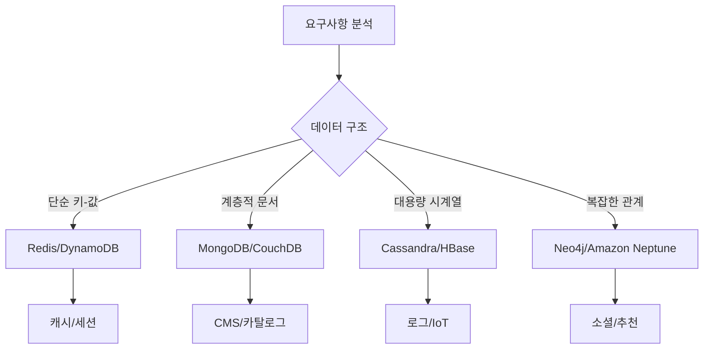
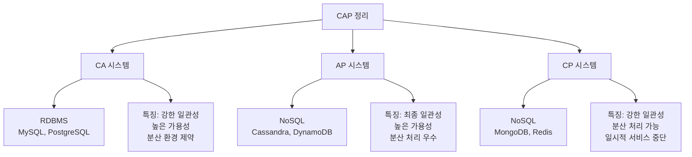

# 💿 부록B NoSQL 이해하기

## 🥅 책 읽기 전

-

## 📚 책 내용 정리

### NoSQL이란?

#### 🏠 집 짓기 비유로 이해하기

**RDBMS (관계형 DB)** = 아파트 🏢

- 정해진 구조 (방 개수, 구조가 모든 집 동일)
- 규칙이 엄격함 (관리사무소 = 트랜잭션)
- 안전하고 체계적

**NoSQL** = 다양한 주택들 🏘️

- 단독주택, 타운하우스, 펜션 등 다양한 형태
- 필요에 따라 자유롭게 설계
- 유연하고 확장 가능

#### NoSQL의 정의

- **Not Only SQL**: SQL만이 아닌 다양한 데이터 저장 방식
- **Non-Relational**: 관계형 모델을 따르지 않는 데이터베이스
- **Schema-less 또는 Flexible Schema**: 고정된 스키마가 없거나 유연한 스키마

---

### NoSQL을 사용하는 이유

#### 🚀 주요 4가지 이유

| 이유                   | 설명                             | 실제 사례                                  |
| ---------------------- | -------------------------------- | ------------------------------------------ |
| **대용량 데이터 처리** | 페타바이트급 데이터 저장 및 처리 | Discord: 수조개 메시지 (ScyllaDB 70+ 노드) |
| **고속 성능**          | 빠른 읽기/쓰기 성능              | Redis: 초당 수십만 요청 처리               |
| **특정 요구사항**      | 용도별 최적화된 데이터 모델      | MongoDB: JSON 문서 저장에 최적화           |
| **유연한 스키마**      | 구조 변화에 빠른 대응            | 스타트업: 빠른 기능 변경 대응              |

#### 1. 📊 대용량 데이터 처리

##### 🌎 실제 규모 예시

```
📱 Discord (2023년 기준)
├── 메시지 수: 수 조개
├── 사용자 수: 수억 명
├── ScyllaDB 노드: 70개 이상
└── 처리량: 초당 수십만 메시지
```

#### 2. ⚡ 고속 성능의 비밀

##### ACID vs 성능 트레이드오프

```
🏦 은행 (RDBMS 필요)
└── ACID 완전 준수 → 안전하지만 느림

🎮 게임 순위표 (NoSQL 적합)
└── 약간의 불일치 허용 → 빠른 업데이트
```

##### 성능 최적화 기법

- **메모리 집약적 사용**: 디스크 I/O 최소화
- **인덱스 최소화**: 복잡한 인덱스 구조 제거
- **분산 병렬 처리**: 여러 노드에서 동시 처리

#### 3. 🎯 특정 용도별 최적화

##### 용도별 데이터 모델

```
🔑 키-값 모델 (Redis)
"user:123" → {"name": "김철수", "score": 1500}

📄 문서 모델 (MongoDB)
{
  "user_id": "123",
  "profile": {
    "name": "김철수",
    "preferences": ["게임", "영화"]
  }
}

🕸️ 그래프 모델 (Neo4j)
(김철수) -[친구]-> (이영희) -[좋아함]-> (커피)
```

#### 4. 🔄 유연한 스키마

##### RDBMS vs NoSQL 스키마 변경

```sql
-- RDBMS: 스키마 변경이 복잡
ALTER TABLE users ADD COLUMN preferences TEXT;
-- 모든 기존 데이터에 영향, 다운타임 발생 가능

-- NoSQL: 자유로운 구조 변경
// 기존 문서
{"name": "김철수", "age": 25}

// 새로운 필드 자유롭게 추가
{"name": "이영희", "age": 30, "preferences": ["영화", "독서"]}
```

---

### RDBMS vs NoSQL 확장성 비교

#### 🏗️ 확장 방식의 차이

##### 수직 확장 (Scale-Up) vs 수평 확장 (Scale-Out)

```
🏢 RDBMS 수직 확장 (Scale-Up)
┌─────────────────┐     ┌─────────────────┐
│   서버 업그레이드  │ ──→ │  더 강력한 서버   │
│   CPU: 4코어     │     │   CPU: 16코어    │
│   RAM: 16GB     │     │   RAM: 128GB    │
│   한계: 물리적 제한 │     │   비용: 기하급수적│
└─────────────────┘     └─────────────────┘

🌐 NoSQL 수평 확장 (Scale-Out)
┌─────┐     ┌─────┐ ┌─────┐ ┌─────┐ ┌─────┐
│서버1│ ──→ │서버1│ │서버2│ │서버3│ │서버4│
│ 4코어│     │ 4코어│ │ 4코어│ │ 4코어│ │ 4코어│
└─────┘     └─────┘ └─────┘ └─────┘ └─────┘
            무제한 확장 가능, 비용 효율적
```

#### 📊 샤딩 vs 클러스터 비교

| 특징            | RDBMS 샤딩                           | NoSQL 클러스터           |
| --------------- | ------------------------------------ | ------------------------ |
| **개념**        | 10개의 별도 DB                       | 1개의 논리적 DB          |
| **장애 처리**   | 1개 DB 장애 시 해당 데이터 사용 불가 | 자동 복구, 무중단 서비스 |
| **데이터 분산** | 수동 관리 필요                       | 자동 분산 및 재배치      |
| **확장성**      | 제한적                               | 거의 무제한              |

##### 🛡️ 장애 상황 비교

```
💥 RDBMS 샤딩 시 장애
DB1: ✅ 정상    → 사용자 1-1000 정상
DB2: ❌ 장애    → 사용자 1001-2000 서비스 불가
DB3: ✅ 정상    → 사용자 2001-3000 정상

🔧 NoSQL 클러스터 시 장애
Node1: ❌ 장애  → 자동으로 Node4가 대체
Node2: ✅ 정상  → 모든 사용자 정상 서비스
Node3: ✅ 정상
Node4: ✅ 대체
```

---

### NoSQL의 종류

#### 🗂️ 4가지 주요 유형

```
📊 NoSQL 유형별 특징 맵
      단순함 ←────────────→ 복잡함
        │                    │
키-값 DB ├─ 문서 DB ─ 칼럼패밀리 ─┤ 그래프 DB
(Redis)   (MongoDB)  (Cassandra)  (Neo4j)
        │                    │
     속도 중심 ←─────────→ 관계 중심
```

#### 1. 🔑 키-값 데이터베이스

##### 특징

- **구조**: 간단한 Key → Value 매핑
- **장점**: 매우 빠른 읽기/쓰기
- **단점**: 복잡한 쿼리 불가능

##### 📦 상품 창고 비유

```
창고 관리 시스템
선반 번호(Key) → 상품(Value)

A-001 → {"name": "노트북", "quantity": 50}
B-102 → {"name": "마우스", "quantity": 200}
C-205 → {"name": "키보드", "quantity": 100}
```

##### 주요 사용 사례

| 용도          | 예시                           | 이유                  |
| ------------- | ------------------------------ | --------------------- |
| **세션 관리** | 로그인 상태 저장               | 빠른 조회 필요        |
| **캐시**      | 자주 조회되는 데이터 임시 저장 | 초고속 성능           |
| **순위표**    | 게임 점수 랭킹                 | Redis Sorted Set 활용 |
| **메시징 큐** | 실시간 채팅, 알림              | Redis Pub/Sub 기능    |

##### Redis 특별 기능

```python
# 순위표 구현 (Sorted Set)
redis.zadd("game_ranking", {"user1": 1500, "user2": 1200, "user3": 1800})
redis.zrevrange("game_ranking", 0, 9)  # 상위 10명 조회

# 메시징 큐 구현
redis.lpush("task_queue", "send_email")  # 작업 추가
redis.brpop("task_queue")  # 작업 처리 대기
```

#### 2. 📄 문서 데이터베이스

##### 특징

- **구조**: JSON과 유사한 문서 저장
- **장점**: 유연한 스키마, 중첩 구조 지원
- **단점**: 복잡한 관계 쿼리 어려움

##### 📚 도서관 비유

```
도서관의 책 정보 카드
각 책마다 다른 정보를 가질 수 있음

책1: {
  "title": "해리포터",
  "author": "J.K. 롤링",
  "series": 7,
  "translations": ["Korean", "French"]
}

책2: {
  "title": "수학의 정석",
  "author": "홍성대",
  "level": "고등학교",
  "subjects": ["미적분", "확률과 통계"]
}
```

##### MongoDB 문서 구조 예시

```javascript
// 전자상거래 주문 문서
{
  "_id": "order_123",
  "customer": {
    "name": "김철수",
    "email": "kim@example.com",
    "address": {
      "city": "서울",
      "district": "강남구",
      "detail": "테헤란로 123"
    }
  },
  "items": [
    {
      "product": "노트북",
      "price": 1500000,
      "quantity": 1
    },
    {
      "product": "마우스",
      "price": 30000,
      "quantity": 2
    }
  ],
  "total": 1560000,
  "status": "delivered",
  "created_at": "2024-01-15T10:30:00Z"
}
```

##### RDBMS vs 문서 DB 모델링 비교

```sql
-- RDBMS: 여러 테이블로 분산
customers (id, name, email)
addresses (id, customer_id, city, district, detail)
orders (id, customer_id, total, status, created_at)
order_items (id, order_id, product, price, quantity)

-- 주문 정보 조회 시 4개 테이블 JOIN 필요
```

```javascript
// MongoDB: 하나의 문서에 모든 정보
// 단일 쿼리로 완전한 주문 정보 조회 가능
db.orders.findOne({ _id: "order_123" });
```

#### 3. 🏛️ 칼럼 패밀리 데이터베이스

##### 특징

- **구조**: 키-값의 확장형, 칼럼을 그룹으로 관리
- **장점**: 대용량 데이터 처리, 우수한 수평 확장
- **단점**: 복잡한 설계, 학습 곡선 높음

##### 🏪 대형마트 진열 비유

```
대형마트의 상품 진열
같은 카테고리끼리 모아서 관리

식품 코너:
Row Key: "food_001"
├── 기본정보: name="사과", price=3000
├── 영양정보: calories=52, vitamin_c=4.6
└── 재고정보: quantity=100, location="A-15"

전자제품 코너:
Row Key: "elec_001"
├── 기본정보: name="스마트폰", price=800000
├── 스펙정보: cpu="A16", memory="128GB"
└── 보증정보: warranty="2년", service_center="강남점"
```

##### Cassandra 데이터 모델 예시

```cql
-- 채팅 메시지 저장
CREATE TABLE chat_messages (
    room_id text,
    timestamp timeuuid,
    user_id text,
    message text,
    message_type text,
    PRIMARY KEY (room_id, timestamp)
) WITH CLUSTERING ORDER BY (timestamp DESC);

-- 효율적인 쿼리
-- ✅ 특정 채팅방의 최근 메시지 조회 (빠름)
SELECT * FROM chat_messages
WHERE room_id = 'room_123'
LIMIT 50;

-- ❌ 특정 사용자의 모든 메시지 조회 (느림)
-- 이런 쿼리를 위해서는 별도 테이블 필요
```

##### 대용량 데이터 처리 사례

```
💬 Discord 메시징 시스템
┌─────────────────────────────────────┐
│           Global Scale              │
├─────────────────────────────────────┤
│ 📊 수조개의 메시지                   │
│ 👥 수억명의 사용자                   │
│ 🌍 70+ ScyllaDB 노드               │
│ ⚡ 초당 수십만 메시지 처리           │
└─────────────────────────────────────┘
```

#### 4. 🕸️ 그래프 데이터베이스

##### 특징

- **구조**: 노드(Node)와 관계(Relationship)로 데이터 표현
- **장점**: 복잡한 관계 쿼리에 최적화
- **단점**: 간단한 CRUD에는 오버스펙

##### 🕸️ 인맥 네트워크 비유

```
소셜 네트워크 관계도
사람들 간의 다양한 관계를 표현

(김철수) -[친구]-> (이영희)
    │                  │
   [동료]              [좋아함]
    │                  │
   ↓                  ↓
(박민수) -[형제]-> (박영수) -[팔로우]-> (카페)
```

##### Neo4j 쿼리 예시 (Cypher)

```cypher
// 친구의 친구 찾기 (2단계 관계)
MATCH (me:Person {name: "김철수"})-[:FRIEND]->(friend)-[:FRIEND]->(friendOfFriend)
WHERE friendOfFriend <> me
RETURN friendOfFriend.name

// 추천 시스템: 나와 비슷한 취향의 사람들이 좋아하는 것
MATCH (me:Person {name: "김철수"})-[:LIKES]->(item)<-[:LIKES]-(similar:Person)
MATCH (similar)-[:LIKES]->(recommendation)
WHERE NOT (me)-[:LIKES]->(recommendation)
RETURN recommendation.name, COUNT(*) as score
ORDER BY score DESC
```

##### 주요 사용 사례

| 용도              | 예시                    | 그래프의 장점         |
| ----------------- | ----------------------- | --------------------- |
| **소셜 네트워크** | 페이스북 친구 관계      | 복잡한 인맥 관계 추적 |
| **추천 시스템**   | 넷플릭스 영화 추천      | 사용자-상품 관계 분석 |
| **부정 탐지**     | 신용카드 이상 거래 탐지 | 의심스러운 패턴 발견  |
| **지식 그래프**   | 구글 검색 결과          | 개념 간 관계 표현     |

---

### NoSQL 도입 시 고려사항

#### 🤔 도입 전 체크리스트

##### 1. 🔐 트랜잭션 지원 여부

```
💰 은행 시스템 (RDBMS 필수)
계좌 A: -10만원
계좌 B: +10만원
→ 둘 다 성공하거나 둘 다 실패해야 함 (ACID 필수)

🎮 게임 순위표 (NoSQL 적합)
플레이어 점수 업데이트
→ 잠시 불일치 허용 가능, 빠른 처리가 중요
```

##### 트랜잭션 지원 수준 비교

| 데이터베이스         | ACID 지원 | 사용 권장 사례            |
| -------------------- | --------- | ------------------------- |
| **MySQL/PostgreSQL** | 완전 지원 | 금융, 결제, 재고 관리     |
| **MongoDB**          | 부분 지원 | 콘텐츠 관리, 로그 수집    |
| **Redis**            | 제한적    | 캐시, 세션, 실시간 데이터 |
| **Cassandra**        | 최소 지원 | 대용량 로그, IoT 데이터   |

##### 2. 📋 데이터 모델 적합성



##### 실제 사례별 선택 가이드

```
📝 설문조사 시스템
문제: 질문-답변의 복잡한 계층 구조
해결: MongoDB (문서 DB)
{
  "survey_id": "survey_001",
  "questions": [
    {
      "type": "multiple_choice",
      "question": "좋아하는 색깔은?",
      "options": ["빨강", "파랑", "노랑"],
      "sub_questions": [
        {
          "condition": "빨강 선택시",
          "question": "이유는?"
        }
      ]
    }
  ]
}

🏃‍♂️ 실시간 순위표
문제: 초당 수만 명의 점수 업데이트
해결: Redis (키-값 DB)
redis.zadd("ranking", {"player1": 1500, "player2": 1200})

💬 대규모 채팅 시스템
문제: 수십억 개의 메시지 저장
해결: Cassandra (칼럼 패밀리)
room_id + timestamp를 키로 사용하여 효율적 저장
```

##### 3. ⚡ 확장성과 성능 요구사항

##### 성능 요구사항별 선택 기준

| 요구사항        | 권장 NoSQL     | 예상 성능            |
| --------------- | -------------- | -------------------- |
| **초고속 읽기** | Redis (메모리) | 100만+ ops/sec       |
| **대용량 쓰기** | Cassandra      | 100만+ writes/sec    |
| **복잡한 쿼리** | MongoDB        | 수천 queries/sec     |
| **그래프 탐색** | Neo4j          | 수백만 관계 탐색/sec |

##### 확장성 시나리오

```
📈 서비스 성장 단계별 DB 전략

1단계: 스타트업 (사용자 < 1만)
├── RDBMS (MySQL/PostgreSQL)
└── 이유: 개발 속도, 팀 역량

2단계: 성장기 (사용자 1만~100만)
├── RDBMS + Redis (캐시)
└── 이유: 기존 시스템 유지 + 성능 개선

3단계: 대규모 (사용자 100만+)
├── RDBMS (핵심 비즈니스)
├── MongoDB (콘텐츠)
├── Redis (캐시/세션)
└── Cassandra (로그/이벤트)
```

##### 4. 👥 운영과 개발 역량

---

### CAP 정리

#### 🎯 CAP 정리란?

> **분산 시스템에서는 일관성(Consistency), 가용성(Availability), 분할내성(Partition Tolerance) 중 최대 2가지만 보장할 수 있다**

#### 🏛️ 은행 지점 비유로 이해하기

```
🏦 전국 은행 지점 네트워크 상황

상황: 서울-부산 간 통신 장애 발생
┌─────────────┐    ❌    ┌─────────────┐
│   서울 지점   │  통신중단  │   부산 지점   │
│  잔액: 100만원│ ←─────→ │  잔액: ???  │
└─────────────┘         └─────────────┘
```

#### 📊 CAP의 3가지 특성

| 특성                               | 설명                                     | 은행 비유                        |
| ---------------------------------- | ---------------------------------------- | -------------------------------- |
| **일관성 (Consistency)**           | 모든 노드가 같은 시점에 같은 데이터를 봄 | 모든 지점에서 동일한 잔액 확인   |
| **가용성 (Availability)**          | 모든 요청이 성공/실패 응답을 받음        | 언제나 서비스 이용 가능          |
| **분할내성 (Partition Tolerance)** | 네트워크 장애가 발생해도 시스템 동작     | 일부 지점과 연결이 끊어져도 운영 |

#### 🔀 CAP 조합별 특성



#### 🏪 실제 상황별 선택 시나리오

##### CA 시스템 (일관성 + 가용성)

```
🏦 은행 계좌 관리 시스템

상황: 서울-부산 통신 장애
선택: 일관성 + 가용성 우선

결과:
❌ 분산 처리 포기
✅ 서울 지점만 운영 (부산 지점 일시 중단)
✅ 정확한 잔액 보장

적용 DB: MySQL, PostgreSQL (Master-Slave)
```

##### AP 시스템 (가용성 + 분할내성)

```
📱 SNS 좋아요 시스템

상황: 서버 간 통신 장애
선택: 가용성 + 분할내성 우선

결과:
✅ 모든 지역에서 서비스 이용 가능
✅ 네트워크 장애에도 계속 동작
❌ 잠시 다른 좋아요 수 표시 (최종적으로 일치)

적용 DB: Cassandra, DynamoDB
```

##### CP 시스템 (일관성 + 분할내성)

```
🛒 재고 관리 시스템

상황: 창고 간 통신 장애
선택: 일관성 + 분할내성 우선

결과:
✅ 정확한 재고 수량 보장
✅ 분산 환경에서 동작
❌ 일시적으로 주문 받기 중단

적용 DB: MongoDB, Redis Cluster
```

#### 📋 실무 적용 가이드

##### 비즈니스 요구사항별 CAP 선택

| 서비스 유형     | 우선순위    | 권장 CAP   | 권장 DB             |
| --------------- | ----------- | ---------- | ------------------- |
| **금융/결제**   | 정확성      | CA 또는 CP | MySQL, PostgreSQL   |
| **소셜미디어**  | 사용자 경험 | AP         | Cassandra, DynamoDB |
| **게임 순위표** | 실시간성    | AP         | Redis, MongoDB      |
| **재고 관리**   | 정확성      | CP         | MongoDB, HBase      |
| **콘텐츠 관리** | 일관성      | CP         | MongoDB, CouchDB    |

##### 현실적인 CAP 전략

```
🎯 실무에서는 하이브리드 접근

예: 전자상거래 시스템
├── 사용자 정보: CA (MySQL) - 정확성 중요
├── 상품 카탈로그: AP (MongoDB) - 가용성 중요
├── 주문 처리: CP (PostgreSQL) - 일관성 중요
├── 세션/캐시: AP (Redis) - 속도 중요
└── 로그/분석: AP (Cassandra) - 대용량 처리
```

<br>

## 💡 더 찾아본 것

### 🎯 NoSQL이 빠른 이유?

- **"속도를 위해 일부를 포기하는 전략"** 때문

```
🏎️ F1 경주차 vs 🚐 패밀리카

F1 경주차 (NoSQL):
- 속도 최우선 설계
- 안전장치 최소화
- 특정 용도에 특화

패밀리카 (RDBMS):
- 안전성과 편의성 중심
- 다양한 기능 탑재
- 범용적 사용 가능
```

---

#### 1. 💾 메모리 집약적 사용: 디스크 I/O 최소화

##### 🐌 디스크 vs ⚡ 메모리 속도 차이

```
접근 속도 비교 (실제 수치):

💾 메모리 (RAM):     0.1 마이크로초
💿 SSD:             100 마이크로초
🗂️ 하드디스크 (HDD): 10,000 마이크로초

차이: 메모리가 HDD보다 100,000배 빠름!
```

##### 🏪 편의점 vs 창고 비유

RDBMS의 데이터 접근 방식

```
🏪 편의점 (메모리) + 🏭 대형 창고 (디스크)

고객이 콜라를 요청:
1. 편의점에서 확인 (메모리 캐시)
2. 없으면 창고에서 가져오기 (디스크 I/O) ← 느림!
3. 편의점에 진열 (메모리 로딩)
4. 고객에게 판매

문제: 창고 왕복 시간이 너무 오래 걸림
```

NoSQL의 데이터 접근 방식

```
🏪 대형 편의점 (대용량 메모리)

고객이 콜라를 요청:
1. 바로 편의점에서 판매 ✅

전략: 자주 사용하는 모든 데이터를 메모리에 보관
```

##### 실제 구현 예시

- Redis: 완전한 In-Memory DB

```python
# Redis - 모든 데이터가 메모리에 상주
import redis

r = redis.Redis()

# 초고속 읽기/쓰기 (0.1ms 이내)
r.set("user:1000", "김철수")           # 메모리에 즉시 저장
r.get("user:1000")                   # 메모리에서 즉시 조회

# 복잡한 자료구조도 메모리에서 처리
r.zadd("ranking", {"player1": 1500, "player2": 1200})
r.zrevrange("ranking", 0, 9)         # 상위 10명 즉시 조회
```

- MongoDB: 스마트한 메모리 활용

```javascript
// MongoDB - 자주 사용하는 데이터만 메모리에 캐시

// Working Set: 자주 접근하는 데이터 + 인덱스
db.products.find({ category: "electronics" }); // 첫 조회: 디스크 I/O
db.products.find({ category: "electronics" }); // 재조회: 메모리에서 즉시

// 메모리 사용량 확인
db.serverStatus().wiredTiger.cache;
```

##### 💰 메모리 vs 디스크 비용 트레이드오프

```
💵 비용 비교 (2024년 기준):
메모리 (RAM): 1GB당 약 $8
SSD 디스크: 1GB당 약 $0.1

메모리가 80배 비싸지만, 100,000배 빠름!
→ 성능이 중요한 서비스에서는 충분히 투자 가치 있음
```

#### 2. 🗂️ 인덱스 최소화: 복잡한 인덱스 구조 제거

##### 📚 도서관 비유로 이해하기

- RDBMS의 복잡한 인덱스 시스템

```
📚 대형 도서관 (RDBMS)

인덱스 시스템:
├── 제목별 색인
├── 저자별 색인
├── 출판연도별 색인
├── 주제별 색인
├── ISBN별 색인
└── 복합 색인 (저자+연도+주제)

장점: 어떤 조건으로도 빠른 검색 가능
단점:
- 새 책 추가 시 모든 색인 업데이트 필요 (느림)
- 색인 관리 공간과 비용 증가
```

- NoSQL의 단순한 인덱스

```
📖 전문 서점 (NoSQL)

인덱스 시스템:
└── 주요 검색 방법 1-2개만

예: 게임 아이템 DB
├── item_id로만 검색 (Primary Key)
└── category로만 검색 (Single Index)

장점:
- 새 아이템 추가 시 빠른 처리
- 메모리 사용량 최소화
단점: 복잡한 검색 조건 사용 불가
```

##### 실제 성능 비교

- DBMS의 인덱스 오버헤드

```sql
-- MySQL: 복잡한 인덱스 구조
CREATE TABLE products (
    id INT PRIMARY KEY,
    name VARCHAR(100),
    category VARCHAR(50),
    price DECIMAL(10,2),
    brand VARCHAR(50),
    created_at TIMESTAMP
);

-- 다양한 검색을 위한 인덱스들
CREATE INDEX idx_category ON products(category);
CREATE INDEX idx_price ON products(price);
CREATE INDEX idx_brand ON products(brand);
CREATE INDEX idx_category_price ON products(category, price);
CREATE INDEX idx_brand_price ON products(brand, price);

-- 문제점:
-- 1. 인덱스 저장 공간: 원본 데이터의 30-50%
-- 2. INSERT 시 6개 인덱스 모두 업데이트 필요
-- 3. 인덱스 간 동기화 오버헤드
```

- NoSQL의 단순한 접근

```javascript
// MongoDB: 필수 인덱스만 생성
db.products.createIndex({ category: 1 }); // 카테고리별 검색만

// Redis: 데이터 구조 자체가 인덱스 역할
// Sorted Set을 사용한 가격별 정렬
redis.zadd("products:by_price", {
  laptop: 1500000,
  mouse: 30000,
  keyboard: 80000,
});

// 가격 범위 검색이 인덱스 없이도 빠름
redis.zrangebyscore("products:by_price", 50000, 200000);
```

##### 🎯 용도별 최적화 전략

- 게임 순위표 시스템

```python
# ❌ RDBMS 방식: 복잡한 인덱스 필요
"""
CREATE TABLE rankings (
    user_id INT,
    score INT,
    level INT,
    region VARCHAR(50),
    game_mode VARCHAR(50)
);

-- 다양한 순위 조회를 위한 인덱스들
CREATE INDEX idx_score ON rankings(score DESC);
CREATE INDEX idx_level_score ON rankings(level, score DESC);
CREATE INDEX idx_region_score ON rankings(region, score DESC);
CREATE INDEX idx_mode_level_score ON rankings(game_mode, level, score DESC);
"""

# ✅ Redis 방식: 자료구조 자체가 최적화
redis.zadd("global_ranking", {"player1": 1500, "player2": 1200})
redis.zadd("level1_ranking", {"player1": 1500, "player3": 900})
redis.zadd("korea_ranking", {"player1": 1500, "player4": 800})

# 인덱스 없이도 초고속 순위 조회
redis.zrevrange("global_ranking", 0, 9)  # 글로벌 탑 10
redis.zrevrange("korea_ranking", 0, 9)   # 한국 탑 10
```

#### 3. 🌐 분산 병렬 처리: 여러 노드에서 동시 처리

##### 🏭 공장 생산라인 비유

- RDBMS: 중앙집중식 생산

```
🏭 단일 거대 공장 (RDBMS)

                [메인 서버]
                     │
            ┌────────┼────────┐
         작업1    작업2    작업3
         (순차 처리)

특징:
- 모든 작업이 하나의 서버에서 처리
- 순차적 처리로 안전하지만 느림
- 서버 한 대가 고장나면 전체 중단
```

- NoSQL: 분산 병렬 생산

```
🏭 여러 공장의 협업 (NoSQL)

[서버1]    [서버2]    [서버3]    [서버4]
   │          │          │          │
 작업1      작업2      작업3      작업4
      (동시 병렬 처리)

특징:
- 여러 서버에서 동시 작업
- 병렬 처리로 빠른 속도
- 일부 서버 고장해도 계속 동작
```

##### 실제 분산 처리 예시

- Cassandra의 분산 쓰기

```python
# 대용량 채팅 메시지 저장
"""
메시지 분산 저장 과정:

1. 클라이언트가 메시지 전송
   ↓
2. 해시 함수로 저장할 노드 결정
   hash("room_123_msg_456") → Node 2
   ↓
3. 3개 노드에 복사본 저장 (병렬)
   Node 2 (Primary) ← 동시 저장 → Node 3 (Replica 1)
                                 → Node 4 (Replica 2)
   ↓
4. 2개 이상 성공하면 완료 응답
"""

# 실제 코드
from cassandra.cluster import Cluster

cluster = Cluster(['node1', 'node2', 'node3'])
session = cluster.connect('chat_db')

# 메시지 저장 - 자동으로 적절한 노드에 분산
session.execute("""
    INSERT INTO messages (room_id, timestamp, user_id, content)
    VALUES (?, ?, ?, ?)
""", ("room_123", datetime.now(), "user_456", "안녕하세요!"))
```

##### MongoDB의 샤딩 (자동 분산)

```javascript
// MongoDB 샤딩 설정
sh.enableSharding("ecommerce");
sh.shardCollection("ecommerce.orders", { customer_id: 1 });

/*
주문 데이터 자동 분산:

Shard 1: customer_id 1~1000의 주문
Shard 2: customer_id 1001~2000의 주문  
Shard 3: customer_id 2001~3000의 주문

쿼리 실행 시:
*/

// 특정 고객 주문 조회 - 해당 샤드에서만 검색
db.orders.find({ customer_id: 1500 }); // Shard 2에서만 검색

// 전체 매출 조회 - 모든 샤드에서 병렬 검색 후 결과 합산
db.orders.aggregate([{ $group: { _id: null, total: { $sum: "$amount" } } }]);
```

##### 🚀 병렬 처리 성능 이점

- 실제 성능 비교 시나리오

```
📊 1억 개의 상품 데이터에서 특정 조건 검색

단일 서버 (RDBMS):
├── 검색 시간: 30초
├── CPU 사용률: 100% (1개 코어)
└── 메모리 사용률: 80%

4개 서버 클러스터 (NoSQL):
├── 검색 시간: 8초 (3.75배 빠름)
├── CPU 사용률: 70% (4개 코어 분산)
└── 메모리 사용률: 60% (분산)

추가 서버 증설 시:
8개 서버 → 검색 시간: 4초
16개 서버 → 검색 시간: 2초
```

##### 🛡️ 장애 복구 메커니즘

- 자동 장애 감지 및 복구

```
💥 서버 장애 발생 시나리오

정상 상태:
[서버1] ← 데이터 복제 → [서버2] ← 데이터 복제 → [서버3]
   ✅                        ✅                        ✅

서버2 장애 발생:
[서버1] ← 데이터 복제 → [서버2] ← 데이터 복제 → [서버3]
   ✅                        ❌                        ✅

자동 복구:
1. 서버1, 3이 서버2 장애 감지 (수초 내)
2. 서버2로 가던 요청을 서버1, 3으로 재분배
3. 새로운 서버4 추가하여 복제본 재구성
4. 서비스 중단 없이 정상 운영 지속
```

---

#### 🎯 3가지 기법의 시너지 효과

```
🏁 F1 레이싱팀의 완벽한 협업

1. 💾 메모리 집약적 사용 = 최고급 연료
   - 가장 빠른 연료 사용
   - 비싸지만 최고 성능

2. 🗂️ 인덱스 최소화 = 경량화된 차체
   - 불필요한 장비 제거
   - 속도에만 집중

3. 🌐 분산 병렬 처리 = 팀워크
   - 각 팀원이 전문 분야 담당
   - 동시 작업으로 효율 극대화
```

## 👀 질문

-

## 🎀 소감

-
