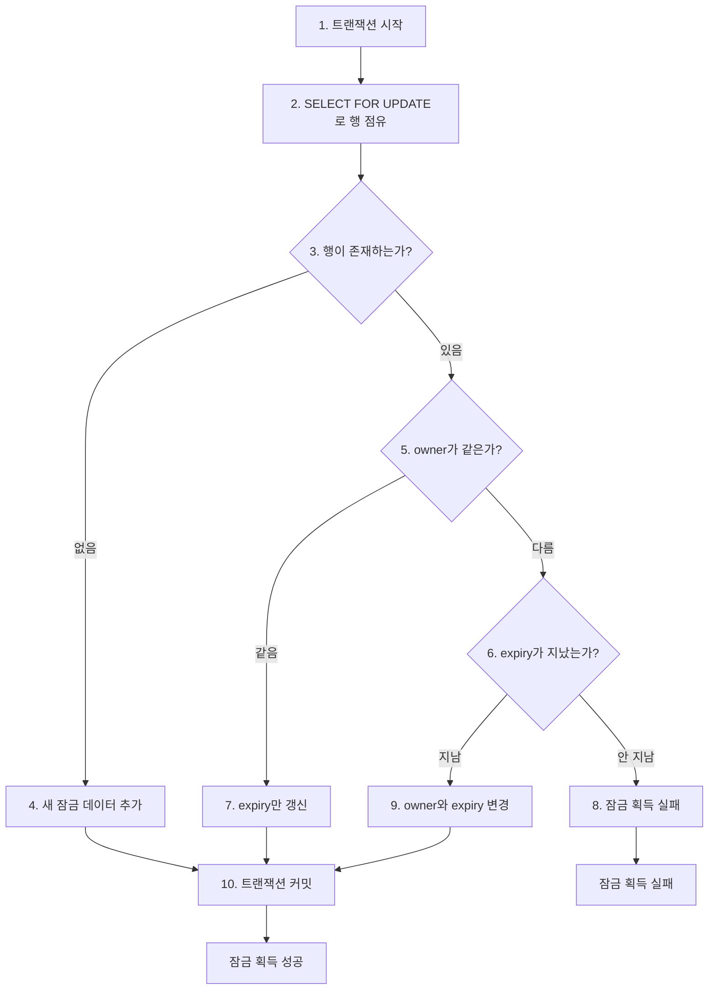

# 🏰 부록C DB로 분산 잠금 구현하기

## 🥅 책 읽기 전

## 📚 책 내용 정리

### 🏪 분산 잠금이 필요한 이유

```
📦 창고에 마지막 상품 1개가 남았을 때
👤 고객 A: "이 상품 주문할게요!"
👤 고객 B: "저도 이 상품 주문할게요!" (동시 발생)

문제: 두 고객 모두 "재고 있음"을 확인하고 주문 진행
결과: 재고 -1개 (음수 재고 발생)

해결: 한 번에 한 고객만 재고를 확인하고 주문하도록 제한
```

### 실제 시스템에서의 필요성

| 상황                        | 문제점                      | 분산 잠금 필요성         |
| --------------------------- | --------------------------- | ------------------------ |
| **여러 서버에서 동일 작업** | 중복 실행으로 데이터 불일치 | 한 서버만 작업 수행 보장 |
| **배치 작업**               | 동시 실행으로 리소스 충돌   | 순차적 실행 보장         |
| **카운터/순번 생성**        | 중복 번호 생성              | 유일성 보장              |
| **한정 자원 접근**          | 동시 접근으로 한계 초과     | 순서대로 접근 제어       |

> 동시에 두 개 이상의 프로세스가 실행되더라도 그중 하나의 프로세스, 하나의 스레드만 작업을 실행해야 할 경우
> => 분산 잠금이 필요
> => 레디스나 주키퍼 같은 기술을 사용할 수도 있지만 구조를 단순하게 유지하고 싶을 경우 DB분산 잠금 이용 가능

### 잠금 정보 저장 테이블 구조

```sql
CREATE TABLE dist_lock (
    name VARCHAR(100) PRIMARY KEY,  -- 잠금 식별자
    owner VARCHAR(100),             -- 잠금 소유자
    expiry TIMESTAMP               -- 만료 시간
);
```

#### 각 컬럼의 역할

- 📛 name (잠금 식별자)

```
용도: 서로 다른 작업을 구분하는 키

예시:
- "daily-report-generation"     (일일 리포트 생성)
- "inventory-sync"              (재고 동기화)
- "user-point-calculation"      (사용자 포인트 계산)
- "order-sequence-generation"   (주문번호 생성)
```

- 👤 owner (소유자 식별)

```
용도: 여러 프로세스/스레드 중 누가 잠금을 소유했는지 식별

구성 방법:
- 서버명 + 프로세스ID + 스레드ID
- UUID 생성
- 애플리케이션 인스턴스 ID

예시:
- "server1-12345-thread-001"
- "app-instance-uuid-abc123"
- "worker-node-02-process-5678"
```

- ⏰ expiry (만료 시간)

```
용도: 잠금이 영원히 유지되는 것을 방지

필요한 이유:
1. 프로세스 갑작스런 종료 (서버 다운, 네트워크 단절)
2. 무한 루프나 hang 상태
3. 예외 발생으로 정상적인 해제 실패

일반적인 만료 시간:
- 빠른 작업: 30초 ~ 2분
- 배치 작업: 10분 ~ 1시간
- 대용량 처리: 수 시간
```

### 분산 잠금 동작 과정

#### 🔄 8단계 잠금 획득 절차



#### 상세 시나리오별 동작

- 시나리오 1: 첫 번째 잠금 시도

```sql
-- 1. 잠금 조회 (행이 없음)
SELECT * FROM dist_lock WHERE name = 'daily-report' FOR UPDATE;
-- 결과: 0 rows

-- 2. 새 잠금 생성
INSERT INTO dist_lock (name, owner, expiry)
VALUES ('daily-report', 'server1-thread1', '2024-01-15 15:30:00');

-- 3. 잠금 획득 성공!
```

- 시나리오 2: 동일 소유자의 재시도 (expiry 연장)

```sql
-- 1. 기존 잠금 확인
SELECT * FROM dist_lock WHERE name = 'daily-report' FOR UPDATE;
-- 결과: owner='server1-thread1', expiry='2024-01-15 15:25:00'

-- 2. 소유자가 같으므로 만료시간 연장
UPDATE dist_lock
SET expiry = '2024-01-15 15:35:00'
WHERE name = 'daily-report';

-- 3. 잠금 연장 성공!
```

- 시나리오 3: 다른 소유자, 만료 시간 지남 (잠금 탈취)

```sql
-- 1. 기존 잠금 확인
SELECT * FROM dist_lock WHERE name = 'daily-report' FOR UPDATE;
-- 결과: owner='server1-thread1', expiry='2024-01-15 15:20:00'
-- 현재 시간: 2024-01-15 15:25:00 (만료됨!)

-- 2. 만료된 잠금을 새 소유자로 변경
UPDATE dist_lock
SET owner = 'server2-thread5', expiry = '2024-01-15 15:35:00'
WHERE name = 'daily-report';

-- 3. 잠금 획득 성공!
```

- 시나리오 4: 다른 소유자, 만료 시간 안 지남 (잠금 실패)

```sql
-- 1. 기존 잠금 확인
SELECT * FROM dist_lock WHERE name = 'daily-report' FOR UPDATE;
-- 결과: owner='server1-thread1', expiry='2024-01-15 15:30:00'
-- 현재 시간: 2024-01-15 15:25:00 (아직 유효함)

-- 2. 다른 소유자가 유효한 잠금을 보유 중
-- 3. 잠금 획득 실패! (아무 작업 안 함)
```

### DB 잠금 구현 코드 분석

#### 핵심 메서드 구조

```java
public class DistLock {
    private final DataSource dataSource;

    public boolean tryLock(String name, String owner, Duration duration) {
        // 1단계: DB 연결 및 트랜잭션 시작
        // 2단계: SELECT FOR UPDATE로 행 조회
        // 3단계: 상황별 처리 로직
        // 4단계: 트랜잭션 커밋/롤백
        // 5단계: 결과 반환
    }
}
```

#### 🔍 SELECT FOR UPDATE의 핵심 역할

```java
private LockOwner getLockOwner(Connection conn, String name) throws SQLException {
    try (PreparedStatement pstmt = conn.prepareStatement(
            "select * from dist_lock where name = ? for update")) {
        // 🔒 FOR UPDATE의 효과:
        // - 이 행을 다른 트랜잭션이 동시에 조회/수정 불가
        // - 한 번에 하나의 스레드만 이 코드 블록 실행 가능
        // - 트랜잭션 커밋 시까지 배타적 잠금 유지

        pstmt.setString(1, name);
        try (ResultSet rs = pstmt.executeQuery()) {
            if (rs.next()) {
                return new LockOwner(
                    rs.getString("owner"),
                    rs.getTimestamp("expiry").toLocalDateTime()
                );
            }
        }
    }
    return null; // 행이 없으면 null 반환
}
```

#### 상황별 처리 로직

```java
public boolean tryLock(String name, String owner, Duration duration) {
    Connection conn = null;
    boolean owned = false;

    try {
        conn = dataSource.getConnection();
        conn.setAutoCommit(false); // 수동 트랜잭션 시작

        LockOwner lockOwner = getLockOwner(conn, name); // 🔒 배타적 조회

        if (lockOwner == null || lockOwner.owner() == null) {
            // 📝 케이스 1: 아직 아무도 잠금을 소유하지 않음
            insertLockOwner(conn, name, owner, duration);
            owned = true;

        } else if (lockOwner.isOwnedBy(owner)) {
            // 🔄 케이스 2: 내가 이미 소유하고 있음 (만료시간 연장)
            updateLockOwner(conn, name, owner, duration);
            owned = true;

        } else if (lockOwner.isExpired()) {
            // ⏰ 케이스 3: 다른 사람이 소유했지만 만료됨 (탈취)
            updateLockOwner(conn, name, owner, duration);
            owned = true;

        } else {
            // ❌ 케이스 4: 다른 사람이 유효하게 소유 중 (실패)
            owned = false;
        }

        conn.commit(); // 🎯 트랜잭션 커밋 시 잠금 해제

    } catch (Exception e) {
        owned = false;
        rollback(conn); // 예외 발생 시 롤백
    } finally {
        close(conn);
    }

    return owned;
}
```

### 실무 활용 예시

#### 📊 일일 배치 작업 예시

```java
@Component
public class DailyReportService {

    @Autowired
    private DistLock distLock;

    @Scheduled(cron = "0 0 2 * * *") // 매일 새벽 2시
    public void generateDailyReport() {
        String lockName = "daily-report-generation";
        String owner = getServerIdentity(); // "server1-app-instance-001"
        Duration lockDuration = Duration.ofHours(2); // 2시간 제한

        if (distLock.tryLock(lockName, owner, lockDuration)) {
            try {
                log.info("일일 리포트 생성 시작");

                // 1. 어제 주문 데이터 집계
                aggregateOrderData();

                // 2. 매출 통계 계산
                calculateSalesStatistics();

                // 3. 리포트 파일 생성
                generateReportFile();

                // 4. 이메일 발송
                sendReportEmail();

                log.info("일일 리포트 생성 완료");

            } catch (Exception e) {
                log.error("일일 리포트 생성 실패", e);
            } finally {
                // 작업 완료 후 잠금 해제
                distLock.releaseLock(lockName, owner);
            }
        } else {
            log.warn("다른 서버에서 일일 리포트 생성 중 - 스킵");
        }
    }
}
```

### 장단점 및 고려사항

#### ✅ 장점

| 장점                | 설명                       | 비교                                  |
| ------------------- | -------------------------- | ------------------------------------- |
| **구현 단순성**     | 기존 DB 인프라 활용        | Redis/ZooKeeper 대비 추가 설치 불필요 |
| **트랜잭션 안전성** | ACID 속성 보장             | 데이터 일관성 완벽 보장               |
| **운영 편의성**     | 기존 DB 모니터링 도구 활용 | 별도 모니터링 시스템 불필요           |
| **장애 복구**       | DB 백업/복구 체계 활용     | 잠금 상태도 함께 복구                 |

#### ⚠️ 단점 및 제한사항

| 단점            | 설명                 | 완화 방법                        |
| --------------- | -------------------- | -------------------------------- |
| **성능 제약**   | DB I/O로 인한 지연   | 짧은 잠금 시간, 적절한 배치 크기 |
| **확장성 한계** | DB 동시 연결 수 제한 | Connection Pool 최적화           |
| **단일 장애점** | DB 장애 시 잠금 불가 | DB 이중화, 헬스체크              |
| **긴 트랜잭션** | 다른 트랜잭션 대기   | 타임아웃 설정, 작업 분할         |

### 🎯 언제 사용해야 할까?

#### 추천 상황

- 기존에 안정적인 DB 인프라가 있는 경우
- 분산 잠금 빈도가 높지 않은 경우 (초당 수십 회 이하)
- 구현 복잡도를 낮추고 싶은 경우
- 강한 일관성이 필요한 경우

#### 대안 고려 상황

- 초당 수백~수천 회의 잠금이 필요한 경우 → **Redis**
- 분산 시스템의 리더 선출이 필요한 경우 → **ZooKeeper/etcd**
- 마이크로서비스 간 coordination이 필요한 경우 → **Consul**

## 🔎 더 읽어볼 내용

- [WMS 재고 이관을 위한 분산 락 사용기](https://techblog.woowahan.com/17416/)
- [MySQL을 이용한 분산락으로 여러 서버에 걸친 동시성 관리](https://techblog.woowahan.com/2631/)
- [풀필먼트 입고 서비스팀에서 분산락을 사용하는 방법 - Spring Redisson](https://helloworld.kurly.com/blog/distributed-redisson-lock/)
- [동시성 문제와 분산 락](https://velog.io/@hyeok-kong/%EB%8F%99%EC%8B%9C%EC%84%B1-%EB%AC%B8%EC%A0%9C%EC%99%80-%EB%B6%84%EC%82%B0-%EB%9D%BD)
- [Distributed Lock 구현 과정](https://channel.io/ko/blog/articles/distributedlock-abc2d95c)
- [[Redis] 레디스가 제공하는 분산락(RedLock)의 특징과 한계](https://mangkyu.tistory.com/311)
- [[Java] Redis을 활용한 다양한 분산락 구현 방안들](https://velog.io/@gyrbs22/Java-Redis%EC%9D%84-%ED%99%9C%EC%9A%A9%ED%95%9C-%EB%8B%A4%EC%96%91%ED%95%9C-%EB%B6%84%EC%82%B0%EB%9D%BD-%EA%B5%AC%ED%98%84-%EB%B0%A9%EC%95%88%EB%93%A4)

## 👀 질문

-

## 🎀 소감

-
