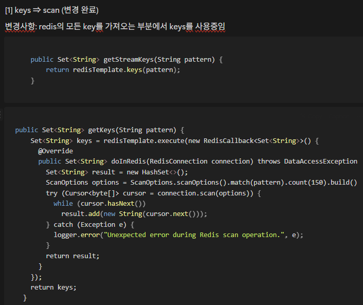
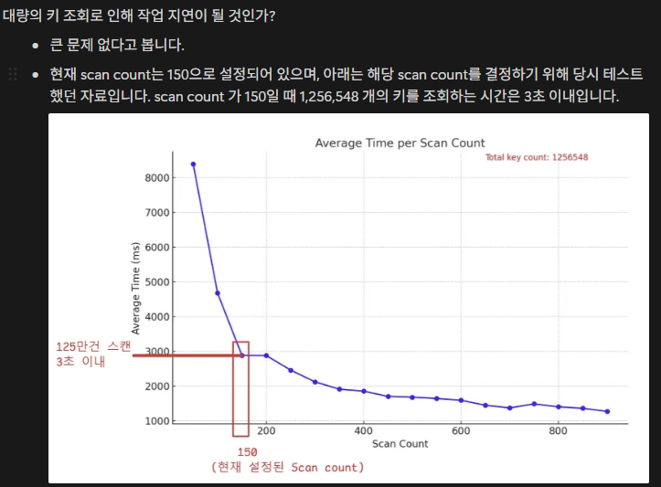

# 📚 개발 도서 스터디 템플릿

## 🧠 1. 책을 읽기 전에
- 목차를 슥 보고 조회 성능 얘기를 보고 떠오른 경험이 있음

- 작년 말 조회 속도 때문에 장애가 난 적이 있습니다. (redis긴 하지만 얘기를 해볼까..) 2년간 잘 운영되던 서비스가 매일밤 스케줄러에서 keys로 모든 키를 조회하는 코드가 있었어요. 운영이 길어지면서 키가 쌓였고(원래 삭제 대상인데 예외로 인해 삭제가 안된 것으로 파악), 조회가 timeout값보다 길어지게 되어서 스케줄러 오류가 한번 났고, 그 이후로 스케줄러 동작 불가!

- keys를 scan 방식으로 바꿔 구현해서 조치를 했어요. 그런 조회 성능 업그레이드 경험이 떠올랐네요.. (당시 변경내역 & 보고사항 첨부합니다!)

---
## 📂 2. 내용 정리 (자신의 언어로 요약)

### 📌 Chapter 03: 성능을 좌우하는 DB 설계와 쿼리

- **핵심 요약**:

- **인상 깊은 내용**:
  > 

- **나의 해석 / 생각**:  
    sql 어설퍼서 멋진 sql 못짜는 것에 약간의 스트레스를 받았고 나 서브쿼리 멋지게 짜고 싶은 생각이 가득했는데 거기에 집착하지 말고 best 쿼리를 사용하자는 마인드 세팅을 하게 되었음

    집계 데이터 만드는 것에 익숙하지 않은데.. 친해져보면 좋을듯 좋아요 개수 등 조만간 집계데이터 구축 해봐야겠다.

---

## 💬 3. 이야기하고 싶은 질문 / 포인트

- 💭 더 알아보고 싶은 개념: 가장 가벼운 쿼리튜닝으로 어떤걸 시도해볼 수 있을까? 다른 분들의 쿼리튜닝 경험담을 들어보고 싶다.

---

## 🎯 4. 정리 & 적용 아이디어

- **내가 배운 것 한 줄 요약**:  
  → `이 장을 통해 나는 ___ 했다.`
- **개발에 어떻게 적용해볼까?**
    - 

---

## 🌟 5. 전체 리뷰

- **별점 평가** (⭐️ 5점 만점): `⭐️⭐️⭐️⭐️⭐️`
- **책에 대한 총평**: 인덱스에 집중한 구성 => 나에게 필요한 내용이었다.
- **이 책을 추천한다면 어떤 사람에게?**