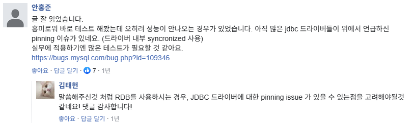

# 📚 개발 도서 스터디 템플릿

## 🧠 1. 책을 읽기 전에

- **알고 싶은 개념 / 주제**: 비동기 구현방식 여러가지

---

## 📂 2. 내용 정리 (자신의 언어로 요약)

비동기 방법 5종
- 별도 스레드, 메시징 시스템, 트랜잭션 아웃박스 패턴, 배치로 연동, CDC 이용하기

별도 쓰레드
- 메서드명에 Async 나타내자. 그리고 내부 예외처리 책임지기
- 쓰레드 하나에 수백 KB니까 쓰레드 N개 생성 메모리, 생성시간, 또 쓰레드 스케줄링 CPU 부담 등 꼭 고려하자. (지난번 이걸 고려해서 적정 쓰레드 수 정했던 경험이 있음, CPU 모니터링도 가볍게 함.. 다음번엔 더 꼼꼼히 해보고 싶음)
- 비동기 실행할 코드가 '외부 API 호출' or 'DB연동같은 네트워크 I/O' 라면, Java의 가상스레드 or 고루틴 사용 고려 => 실제 OS스레드가 아니라 런타임에서 관리하는 경량쓰레드 이점!
- 경량 스레드 모델: 기존 언어의 스레드 모델보다 더 작은 단위로 나눠, 컨텍스트 스위칭 비용과 블로킹 타임을 낮추는 개념

메시징 시스템
- A서비스~B서비스 사이 버퍼역할. 각자의 용량에 맞게 처리 가능해짐. 확장 용이.
- 카프카는 대량(초당 수십-수백), 래빗MQ는 순서중요하거나 AMQP STOMP, 레디스 pub/sub은 유실해도 되고 간단할 때. 그리고 조직의 경험에 맞게 선택하기. 
- 재시도의 위험(?)성: 실제로는 전송 성공했는데 일시적 넷웤 오류로 전송실패로 인지하고 재시도할 수도 있음. 메시징 sys가 중복 수신 방지 기능을 제공하지 않으면, 메시지 소비자가 중복수신 대비해야 함 (메시지마다 고유id 부여)
- 로그찍을떄는 후처리 시도에 도움될 로그를 남기자는 교훈
- "고객은 주문에 실패했다는 에러화면을 봤지만 잠시 뒤에 주문이 완료됐다는 푸시를 받게 된다" => 방지: 트랜잭션 끝난 뒤 메시지를 전송해야 함
- 글로벌 트랜잭션은 커밋 과정이 길어지는만큼 성능 영향 있으므로 꼭 필요치 않다면 DB처리와 메시지연동을 묶지 X.. 대안으로 트랜잭션 아웃박스 패턴 가능
- 메시지 종류에는 이벤트메시지와 커맨드메시지 있음
- 궁극적 일관성이라는 말

트랜잭션 아웃박스 패턴
- 데이터를 DB에 보관하는 방식 (실제 로직의 DB변경 수행 후 -> 메시지 데이터를 '아웃박스 테이블'에 추가' -> 별도의 메시지 중계 프로세스가 주기적으로 읽어 메시징sys에 전송)
- 발송완료 상태 저장 방법? DB 컬럼에 대기/완료/실패 or 메시지 중계 서비스측에서 성공전송한 마지막 ID를 기록. 후자의 경우 2개이상의 메시지 중계 서비스가 있는 경우 좋겠고, 전자는 모니터링에 용이하고 하나일경우. 

배치 전송
- 전통적
- FTP, SFTP 파일전송프로토콜 or SCP 명령어로 수행
- 생산자 -> 소비자: 파일업로드, API로 데이터 전송, 읽기전용 DB 열어주기 (내부용, 급할때, 레거시)
- 전송 실패를 대비하여 재처리 기능을 만들자. (ex: 7시배치고 20분후 끝남 -> 40분쯤 성공여부 판단, 재실행) 또, 배치 재실행 API 만들어두면 대비하기 좋음

CDC (change data capture)
- CDC 처리기는 다양한 대상에 전파 가능 (DB, 메시징sys, API, ..) 특히DB는 단순히 DB간 데이터복제(동기화) 용도로 사용 가능
- 데이터 변경분을 알리는 이벤트 메시지에 가깝다. 변경 정보 정도만 알 수 있는.
- 유용한 경우: 신규주문 생성,변경 ---> 주문시스템 ||| 이때 연동코드 추가가 힘들다면 CDC를 사용 가능. 

---

## 💬 3. 이야기하고 싶은 질문 / 포인트

[공부한 내용 공유]

### [1]

용량: 스레드는 2mb까지 커질 수 있는 반면, 가상 스레드는 50kb

스레드 생성 시간: 기존 스레드는 1밀리세컨드에 가능한 반면, 가상 스레드는 10마이크로 세컨드 내에 가능

### [2] Spring의 방향성

가상스레드 장점은 JVM이 자체적으로 가상스레드를 스케줄링하고 컨텍스트 스위칭 비용이 줄어든다는 것. 그치만 가상스레드가 플랫폼 스레드에 고정되어 장점을 활용하지 못하는 경우가 있다면, 가상스레드 내에서 synchronized block을 사용하거나, JNI를 통해 네이티브 메서드를 사용하는 경우임. 

Spring 로직 내에 많은 syncronized가 있어 효율이 좋지 않다고 함

따라서 Spring은 synchronized를 ReentrantLock으로 마이그레이션하는 방향으로 가고 있다고 함

그 밖에도 많은 진영에서 Virtual Thread를 지원하기 위해 synchronized에서 ReentrantLock으로 마이그레이션이 진행되고 있다.
synchronized가 많이 남아있는 Spring Boot 2.x에서는 Virtual Thread를 잘 사용하기 위해서는 여러 의존 모듈의 마이그레이션이 선행되어야 할 것 같다. 앞으로 미래 Java 버전에서는 synchronized는 점점 사라질 것으로 예상한다.

내용 출처: https://d2.naver.com/helloworld/1203723

### [3] 코루틴과의 비교

Java가상스레드에서는 block되는 코드를 넣어도 됨. 편하게 동기식으로 짜면 됨. 반면 코루틴에서는 block 금지임. 

내용 출처: https://perfectacle.github.io/2023/07/10/java-virtual-thread-vs-kotlin-coroutine/

### [4] 경험: DB 변경 감지

DB 변경 감지 방식에 대해 정리한적이 있는데, 비동기 챕터에서 공유하려 합니다.

▼

이벤트 방식의 경우, DB 및 WAS에 추가 작업이 필요하다. MQ를 새로 도입해야 할 수도 있다.  
- 트리거의 경우, 트리거를 등록해야 한다. 만약 특정 플러그인이 필요하면 설치가 필요하다. (예를 들어 api 호출하려면 sys_exec 함수를 사용하기 위해 lib_mysqludf_sys를 설치해야 함) 
- CDC의 경우, DBMS에 binlog를 ON으로 켜야한다. 확인 방법은 SHOW VARIABLES LIKE 'log_bin'으로 볼 수 있고, 기본값은 OFF다. 이 외에도 다른 값도 설정해야 한다. 또한 DB뿐 아니라 이 binlog를 감지할 CDC 플랫폼인 Debezium(기본값으로 kafka 출력)를 사용해야 하며, 서버에서도 해당 리스너를 작성해야 한다. 즉 MQ를 새롭게 도입해야할 수도 있다.

[고려할 점]
- 트리거: DBMS에 등록해야 한다. 또한 DBMS에서 api를 날리려면 추가기능 설치가 필요하다.
- CDC: DBMS에 추가 설정이 필요하다. 또한 MQ를 사용하는 구조여야 한다.

결국 비동기는 못 사용하고 폴링을 결심했던 경험이 떠오르네요..!
이런 변경 감지 해본 적 있는분 스토리 듣고 싶삼

---

## 🎯 4. 정리 & 적용 아이디어
