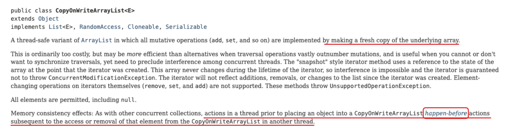

## 🧠 1. 책을 읽기 전에

비동기에 대한 뚜렷한 지식을 갖자구 !


---

## 📂 2. 내용 정리 (자신의 언어로 요약)


### 동시성 문제
- 동시 요청 처리 방식 
	(1) 요청별 스레드
	(2) 비동기IO, 논블로킹IO 사용해서 처리하기
- 프로세스 수준과 DB 수준에서 모두 검토해야 한다.

### 잠금
	단, 잠금 확보한 쓰레드가 해제할 때까지 남은쓰레드들은 대기해야 하니까 CPU 효율은 떨어짐
	잠금 대안으로 원자적 타입을 사용할 수 있음.

#### 🔎 Lock (mutex)
- 프로세스 수준에서의 일반적 방법
- 예시: 동시에 해시맵 수정을 lock 획득 / 해제로 관리 가능 (책 예제: ReentrantLock)
	- 자바의 synchronized에는 없는 기능을 제공 (잠금 획득 대기 시간 지정기능!)
	- 자바 21의 가상스레드는 ReentrantLock만 지원. synchronized는 24부터 지원.
	- 무엇을 사용하든 상관 없는데, 섞어쓰진 말자.
- 조회작업에 Lock 걸어버리면 읽기성능 떨어지므로 막 걸지 말자

#### 🔎 Semaphore
- permit(weight) 지정 가능
	- 용어 리마인드!
		- permit 구하는 연산: P or wait
		- permit 반환 연산: V or signal


#### 🔎 읽기/쓰기 잠금
 
```java
ReadWriteLock lock = new ReentrantReadWriteLock();
Lock writeLock = lock.writeLock();
Lock readLock = lock.readLock();
```
- 쓰기잠금시 쓰는동안 쓰기랑 읽기 불가
- 읽기잠금시 읽는동안 읽기는 자유인데 쓰기 불가

---
### 타입 / 컬렉션

#### 🔎 타입
원자적 타입
- 단일 변수의 원자적 연산 (하나의 메모리 위치)
- `java.util.concurrent.atomic`
- int, long, boolean외에도 AtomicReference 등
- CAS (Compare And Swap): 비교 후 교체하는 연산
동시성 컬렉션
- 자료구조의 동시성 관리 (전체적 자료구조에 대한)
#### 🔎 컬렉션
동기화된 컬렉션
- 데이터를 변경하는 모든 연산에 잠금 적용. 
- `Map<String, String> map = Collections.synchronizedMap(map);`
- 내부적으로 synchronized로 처리된다.
- 자바 23 이전의 가상스레드는 synchronized 지원 안함 => 성능문제 => 사용하지 말자.
동시성 지원 컬렉션
- ConcurrentHashMap
- 잠금 범위를 최소화, 성능 굿 

#### 🔎 불변 값 (CopyOnWriteArrayList???)
자바의 CopyOnWriteArrayList는 요소를 추가/삭제할 때마다 매번 새로운 리스트를 생성해서 반환한다 => 엇 근데 그래도 마찬가지 아닌가..? 
- 내부 전체적으로 락을 사용해서 "복사 -> 수정 -> 교체"까지 원자적으로 한다고함.
```java
// 내부적으로 이런 식으로 동작
public boolean add(E e) {
    final ReentrantReadWriteLock.WriteLock writeLock = lock.writeLock();
    writeLock.lock();
    try {
        Object[] elements = getArray();          // 1. 현재 배열 참조
        int len = elements.length;
        Object[] newElements = Arrays.copyOf(elements, len + 1);  // 2. 복사
        newElements[len] = e;                    // 3. 새 배열에 요소 추가
        setArray(newElements);                   // 4. 참조 교체 (원자적!)
        return true;
    } finally {
        writeLock.unlock();
    }
}
```
- 위 코드 중간에 있는 참조 교체는.. 
```java
private volatile Object[] array;  // volatile로 선언!

final void setArray(Object[] a) {
    array = a;  // 이 한 줄이 원자적 연산
}
```

- happen-before 관계 보장
```java
// 안전한 CopyOnWriteArrayList 사용
// 스레드 1
data = 42;
list.add("signal");  // happen-before 지점

// 스레드 2  
if (!list.isEmpty()) {
    println(data);  // 반드시 42 출력됨
}
```



### DB 동시성
- 비관적 락은 잠금 획득을 위한 대기과정이 길어서 낙관적 락이 빠른실패응답 해주기 좋을지도. 그치만 트랜잭션 도중에 외부연동 건이 있다면 비관적 락이 안전 (낙관적락일 경우 외부에선 성공한 이후 DB 상태 변경하려고 할 때... 버전 맞지 않아서 실패처리될 수도.. (잠깐!) 어 그러면 DB값을 먼저 바꾸고 취소처리하면 안되나? 만약 그렇게 되면 '취소상태' -> '다른 어느 곳에서 취소상태임을 조회함 -> '사실은 연동서비스 취소실패' -> '그래서 취소상태취소' -> '어 머야 사실 취소 아니자나' 이렇게 될 위험이.. 근데 전체적으로 쓰기락을 건다면? 음.. 그러면 낙관적 락이 갖는 이점을 모두 상실해버릴듯!!
- 증분 쿼리 연산이 원자적이라면 그거 사용하면 됨. DBMS마다 다르므로 사전 확인 필수 

### 단일 스레드로 처리
여러스레드 동시접근이 문제니까, 
상태 관리하는 스레드는 하나만 두고, 
작업 요청 스레드가 작업큐에 넣어두는 방식으로만 구현하면 됨.
특히 논블로킹/비동기IO를 사용하는 경우에는 블로킹 연산을 최소화해야하므로 단일스레드 처리 방식이 적합
- 성능? 동시접근 스레드가 적고 수행시간이 적으면 락 사용이 좋음. 큐/채널 처리 시간보다 락 획득/해제가 더 빠르기 떄무네.. 그런데 임계영역 시간 길어지거나 동시 실행 작업이 많으면 큐/채널이 더 나을 수도 있다고 한다.

### 기타 주의사항
잠금 해제, 대기시간 지정, 대기없이 결과 반환하는 tryLock(), 교착상태 피하기(두 자원에 대한 락 설정시... 잠근 대기 시간을 정하거나, 잠금 획득 순서를 고정해두거나), 라이브락 피하기 (잠금 획득에 대한 우선순위 조건 설정하기), 기아 해결 (독점 시간 제한, 점유 못하고 있는 칭구의 우선순위 높이기)


---

## 💬 3. 이야기하고 싶은 질문 / 포인트


- 원자적 타입중에 AtomicReference가 있어서, 어 참조타입이 다 원자적일 수 있다면 동시성 컬렉션이랑 어떤 차이지? 싶었다. 그치만 AtomicReference는 참조 변경이 불가한거고 내부 자료는 변경 가능한 개념이었구나!! 

- 위에서 정리한 CopyOnWriteArrayList.. 에 대한 궁금증을 해결했음

.
.

예전에 나 멀티쓰레드 테스트하느라 샘플 코드 짰을 때, 비동기 처리 했었는데.. 그때 조회&업데이트 로직을 원자적으로 해야 했었음. 그래서 나는 synchronized 블록이랑, 동시성 컬렉션을 둘 다 적용해서 갖다 썼었음.

예시 (재구성)
**문제점**: 읽기 작업까지 모두 블록되어 성능 저하
```java
private final ConcurrentHashMap<String, User> users = new ConcurrentHashMap<>();
private volatile int userCount = 0;

public synchronized void updateUser(User user) {
    // 조회 & 업데이트를 원자적으로 처리
    if (users.containsKey(user.getId())) {
        users.put(user.getId(), user);
    } else {
        users.put(user.getId(), user);
        userCount++;
    }
}

public synchronized User getUser(String id) {
    return users.get(id);  // 읽기도 전체 블록됨
}
```


이때 드는 생각: **혹시 ReadWriteLock만 사용했더라면?**
	- 읽기가 복잡하거나 많을 경우 유리함. 읽기 작업 블록되지 않아 성능 향상
	- 그런데 ReadWriteLock을 쓰면 "쓰기가 계속 대기할 수 있다" (Write Starvation) 읽기가 빈번하고 쓰기가 가끔 있는 경우에 쓰기가 영원히 대기할 위험 있음. 

그래서 알아본
ReadWriteLock..
fair / unfaire lock 개념이 있는데... 기본값으로는 fair가 false이다. 이 때의 동작 방식은.. 

#### Unfare Lock
```java
ReadWriteLock rwLock = new ReentrantReadWriteLock(); // fair=false (기본값)
```
```
// 읽기 스레드들이 계속 들어오는 상황
Thread1: readLock()  ─┐
Thread2: readLock()  ─┤ 동시에 읽기 가능
Thread3: readLock()  ─┘
Thread4: writeLock() ← 대기...

Thread5: readLock()  ← 새로 온 읽기가 먼저 실행됨!
Thread4: writeLock() ← 계속 대기... (starvation!)
```
1. 락을 요청한 순서 무시! 가장 빨리 락 획득할 수 있는 스레드가 먼저 실행
2. 성능이 더 좋지만 starvation 문제 발생 가능.. 

#### Fare Lock 
모든 스레드가 공평하게 실행됨
```java
ReadWriteLock rwLock = new ReentrantReadWriteLock(true); // fair=true
```
```
Thread1: readLock()  ✓ 실행
Thread2: writeLock() ← 큐에 대기
Thread3: readLock()  ← 큐에 대기 (Thread2 뒤에)
Thread4: readLock()  ← 큐에 대기 (Thread3 뒤에)

// 실행 순서: Thread1 → Thread2 → Thread3 → Thread4

- 쓰기 스레드가 요청하면, 그 이후에 오는 읽기 스레드들은 대기
- 쓰기가 완료된 후 대기 중인 읽기들이 실행됨
```
1. 락을 요청한 순서대로 처리 (FIFO)
2. 성능은.. 큐 관리 오버헤드때문에 약간 떨어지지만 Write starvation 방지가능


## 언제 어떤 방식을 선택할까? 

### synchronized + 동시성 컬렉션

- 단순한 로직
- 읽기/쓰기 비율이 비슷한 경우

### ReadWriteLock (Unfair)

- 읽기가 압도적으로 많은 경우
- 최대 성능이 필요한 경우
- 쓰기 지연이 문제되지 않는 경우

### ReadWriteLock (Fair)

- 읽기가 많지만 쓰기도 중요한 경우
- 응답 시간 예측성이 중요한 경우
- 모든 요청이 공평하게 처리되어야 하는 경우


🤔 음.. 내가 그때 구현했던 건 주기적으로 체크하는 모니터링성 작업이고 읽/쓰 비율도 극단적이지 않았어서, 
synchronized + 동시성 컬렉션으로 제어했던게 나쁘지 않았을 것 같다...

.
.

🙋 synchronized 관련 구현해보았던 경험 중.. 고민거리가 있었던 분 있나여? 
	아니면 동시성 컬렉션이나 원자 타입... 등..! 고민을 앓아 본 분들은 어떤 고민이었는지 궁금.. 

---

## 🎯 4. 정리 & 적용 아이디어
