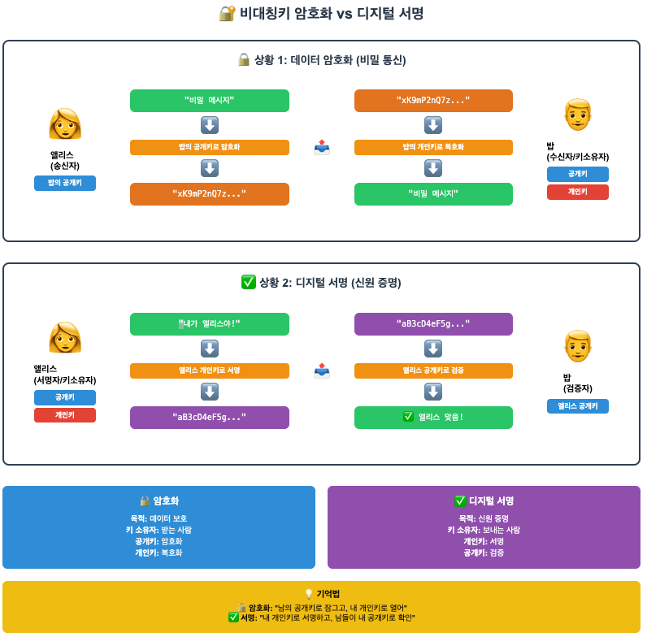
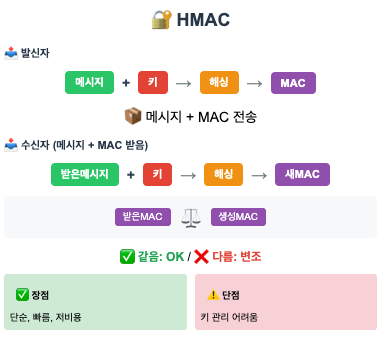
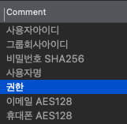
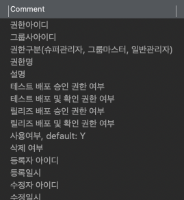
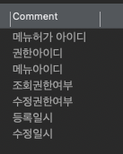

#  1. 책을 읽기 전에

보안! 

---
# 2. 내용 정리
### 👏 토큰
#### 👉 저장 위치
- 서버의 외부 별도 저장소(DB, Redis) 또는 서버 메모리에 가능
- 외부에 저장하는건 예시로 스프링 세션
	- 장점: 내부저장이 단점이 없고, 서블릿의 HttpSession을 그대로 사용가능 
- 메모리에 저장하는건 예시로 서블릿세션 (고유의 세션ID)
	- 문제점
```
1차 요청: 사용자 → A서버 (세션 생성, 메모리 저장)
2차 요청: 사용자 → B서버 (A서버 세션 모름 → 로그인 풀림!)
```
	- 해결 방법은 크게 두가지
	1. 고정 세션
		- 로드밸런서가 같은 사용자를 항상 같은 서버로 보냄
		- 단점은.. 부하 분산 불균등 문제가 있을수도 + 확장성이 좋지 않음
	2. 세션 클러스터링
		- 모든 서버가 세션정보 공유  (A서버 생성 세션을 B, C도 접근가능)
		- 단점은.. 네트워크 오버헤드랑 복잡성..
	

#### 👉 토큰 유효 시간 정하기 `두가지방법`
1. 생성시점 기준
2. 접근시간 기준
	- ex: 서블릿 세션
- 유효 시간은 서비스 성격에 따라 달리 
	- 관리자 사이트: 민감정보 조회이므로 유효시간을 짧게
	- 일반적인 서비스: 10분처럼 짧으면 사용하기 불편함
		- 액세스 토큰: 몇분 ~ 몇시간 내외
		- 리프레시 토큰이 만료될 때까지는 새로 액세스 토큰 발급받아서 불편함없이 로긴 안풀리기 가능
- IP를 같이 따지면 토큰 보안 향상
		- 토큰 생성시점의 ip랑, 접근시 ip랑 동일한지 검증 
		- ip가 다르면 탈취한 토큰으로 여기기


#### 👉 토큰 송수신
- 주로 2가지 방식..
	1. 쿠키: 웹은 보통 쿠키방식 사용. 서버 세션도 쿠키를 사용해서 세션ID를 주고받음... 
		   웹 브라우저는 서버가 전송한 쿠키를 모든 요청에 함께 전송.
		   즉 토큰을 서버에 전송하기 위한 별도 코드를 작성할 필요 음슴
	2. 헤더: 헤더에전송
		
### 👏 암호화 
#### 👉 단방향 암호화
- 복호화 못함
	- 로그인 비번을 잊으면 원본비번을 못 알려주는 개념 
- 해시 함수 알고리즘 예시: SHA-256, MD5, BCrypt
	- 인풋과 아웃풋이 모두 byte[]
	- DB같은데에 저장하려면 문자열이어야 하니까, 
		- 바이트 배열을 문자열로 표현함 by 16진수 표기법, Base64 표기법
```java
public static String encrypt(String input, String salt) {
    StrinbBuilder hexString = new StringBuilder();
    try {
	    // 얻은 해시 바이트배열 (각 0~255)를 16진수로 바꾸는데
	    //                 0~15값은 한글자라서 앞에 0 붙여서 두글자로 맞츄기~ 
        MessageDigest digest = MessageDigest.getInstance("SHA-256");
        digest.update(salt.getBytes()); // salt
        byte[] hash = digest.digest(input.getBytes("UTF-8"));
        for (byte b : hash) {
            String hex = Integer.toHexString(0xff & b);
            if (hex.length() == 1) hexString.append('0');
            hexString.append(hex);
        }
    } catch (Exception e) {
	    throw new RuntimeException(e);
    }
    return hexString.toString();
}
```
- Salt 추가: 해커의 레인보우 테이블이 의미를 가지면 안되니까... 
		- 사용자마다 고유한 값을 생성해서 Salt로 사용하면 된다.
	
#### 👉 양방향 암호화 
- 복호화 가능
	- ssh 프로토콜, https 처럼 보안이 중요한 데이터 송수신 과정에서 주로 사용됨.
- 대표적인 양방향 암호화 알고리즘: AES, RSA
- 대칭키: 암복호화시 동일 키로... 함
	- `AES`: 무작위로 생성한 키, 그리고 초기화벡터! (-> IV는 길이가 16인 byte[]입니더)
		- Key는 보관함니다. 이걸로 암호화 하면 됨 
			- SecretKey key = new SecretKeySpec(bytes, "AES");
		- 근데 매번 같은 Key로 암호화하면 뚫릴 수 있으니까 IV를 쓰는거임
```java
// AES
// 키 & IV로 암복호화 하기 
public static String encrypt(String plain, SecretKey key, byte[] iv) throws Exception {
    Cipher cipher = Cipher.getInstance("AEX/CBC/PKCS5Padding"); // 알고리즘
    IvParameterSpec parameterSpec = new IvParameterSpec(iv);
    cipher.init(Cipher.ENCRYPT_MODE, key, parameterSpec);
    byte[] encrypted = cipher.doFinal(plain.getBytes("UTF-8")); // 암호화 실행
    return Base64.getEncoder().encodeToString(encrytped);
    

}

public static String decrypt(String encrypted, SecretKey key, byte[] iv) throws Exception {
    Cipher cipher = Cipher.getInstance("AES/CBC/PKCS5Padding");
    IvParameterSpec parameterSpec = new IvParameterSpec(iv);
    cipher.init(Cipher.DECRYPT_MODE, key, parameterSpec);
    byte[] decoded = Base64.getDecoder().decode(encrypted); // 어떻게 문자열 변환했는지의 방식도 알아야 하겠슴
    byte[] decrypted = cipher.doFinal(decoded); // 복호화 실행
    return new String(decrypted, "UTF-8");
}
```
- 참고: Cipher객체에 저거: "암호화알고리즘/암호화모드/패딩방식"
	- AES는 정해진 길이의 블록 단위로 암호화를 수행하기 때무우운. 마지막블록 패딩 필요할수도.

- 비대칭키: 서로다른키 사용 (public, private key) 
	- public key로 암호화하고, private 으로 복호화하는!
	- 반대로 private으로 암호화하고 public으로 복호화하는 것도 쓰임
		- 인증목적: 신원확인, 서명, ssh (서버에 공개키를 등록하고, 접속시 개인키를 이용해 인증)
	- `RSA`가 대표적...

RSA 키 만드러볼까요 
```java
KeyPairGenerator keyGen = KeyPairGenerator.getInstance("RSA");
keyGen.initialize(2048);   // 키 길이 bit
KeyPair keyPair = keyGen.generateKeyPair();
// 요 KeyPair에서 PublicKey랑 PrivateKey 얻을 수 있다. 
```

바이트 배열을 PublicKey, PrivateKey 타입으로 변환해볼까효 ... KeyFactory를 통해... 
```java
KeyFactory keyFactory = KeyFactory.getInstance("RSA");
PublicKey publicKey = keyFactory.generatePublic(new X509EncodedKeySpec(publicKeyBytes));
PrivateKey privateKey = keyFactory.generatePrivate(new PKCS8EncodedKeySpec(privateKeyBytes));

new KeyPair(publicKey, privateKey);  
```

RAS 암&복호화 하는 것도 위 대칭키 예제 AES랑 흡사함.. Cipher 객체 통해서 함.. 파라미터 알맞게 넣어주면 될듯.. 
```java
public static String encrypt(String plain, PublicKey publicKey) {
    Cipher cipher = Cihper.getInstance("RSA");
    cipher.init(Cipher.ENCRYPT_MODE, publicKey);
    byte[] encryptedBytes = cipher.doFinal(plain.getByte("UTF-8"));
    return Base64.getEncoder().encodeToString(encrytpedBytes);
}

public static String decrypt(String encrypted, PrivateKey privateKey) {
    Cipher cipher = Cipher.getInstance("RSA");
    cipher.init(Cipher.DECRYPT_MODE, privateKey);
    byte[] decodedBytes = Base64.getDecoder().decode(encrypted);
    byte[] decrytedBytes = cipher.doFinal(decodedBytes);
    return new String(decrytpedBytes, "UTF-8");
}
```





### 👏 HMAC
- 데이터가 위변조되지 않았다는 걸 확인할 수단!!!!!!!!
- 메시지의 무결성과 인증을 보장하기 위해 사용하는 `암호화 기술`
- Hash-based Message Authentication Code
- 발신자&수신자: 너와 나 둘만 💕 알고있는 시쿠릿 키가 있음 🗝️


### 👏 감사 로그 남기기
- 보안 관련 기록
- 사용자 로긴/로가웃 내역,,, 암호 초기화 등 설정변경 내역,,,, 환자 기록을 조회한 의료진 정보,,, 계약서의 수정 이력
- 오 감사로그 같은거 필요성을 깊게 생각해본 적 없는듯? 
- 접근, 변경에 대해 책임을 물을 소지가 있는건 감사로그를 남기려고 해봐야겠다.


---

# 3. 이야기하고 싶은 질문 / 포인트

#### 😉 보안 얘기:
(242p) 
1. 2018 트위터가 로그에 사용자 비번 평문으로 기록되는 문제 있었다구 하는데
우리 플젝도 그런 적 있었음... 2년동안 로그에 고객 개인정보 그대로 찍히고 있었음! (폰번호 등)
작년에 마스킹 함 ㅎㅎ 근데 먼가... ㅠ 너무 안일한 것 아닙니까!! 내가 이제부터 신경 써야겠다. 

2. 보안성 검토 할때 응답 데이터  중 ip 마스킹 걸린 적 이씀
3. 보안성 검토 할 때 걸린거 공유
	- 파일경로 요청 받는 API에서, 악의적으로 상대경로 ../../bin 같은거 넣어서 보내면 접근 가능하므로 API 메서드에 경로 검증 추가했던적 있음
	- 솔직히 개발할때 생각 못했었다.  

#### 😉 인가 어떻게 하시나요? 우리는 이렇게
**DB** 
- 사용자 정보에 권한ID가 있고 

1 ktds
2 ktds
1 kt
2 kt

- 계정 권한 
- (권한id, 그룹사id --- 권한 부여)


- 메뉴 접근 권한 
- (권한id, 메뉴id --- 메뉴 조회, 수정 여부 관리)



#### 😉 질문: 
나는 리프레시 토큰의 특별한 이유를 잘 모르겠다.
결국 탈취 위험만 2배가 되는 거 아닌가.
도대체 이게 왜 표준이지? 
보안성 측면에서 좋다고 말할 수 있는지 모르겠다.
- 엑세스 토큰 바로 탈취
- 리프레시 토큰 탈취 ---> `재발급 요청` ---> 재발급응답으로 액세스 탈취

혹시 저 `재발급 요청 받으면서` 요청에대한 `또다른 보안`을 적용할 수 있기 때문인가? 


---
# 4. 전체 리뷰
구우우웃! 
이전에는 암복호화 용어같은게 많아서 흐린눈을 하곤 했는데
이번 기회에 선명한 눈 할 수 있게 된 느낌이다. 

