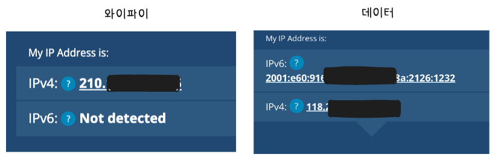
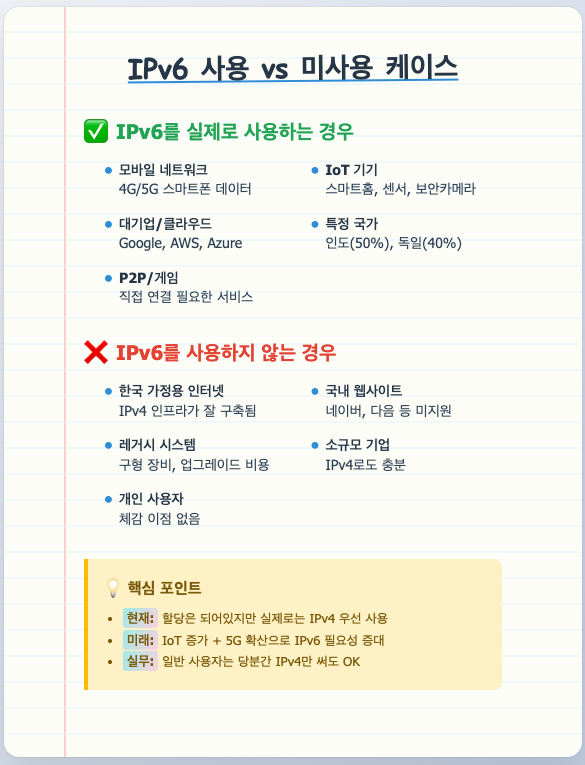
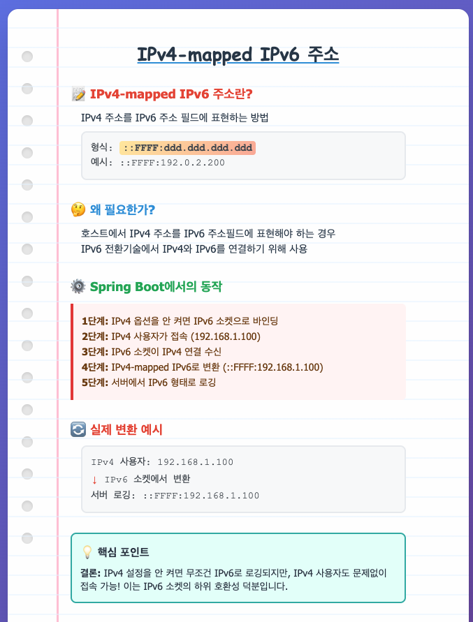

## 🧠 1. 책을 읽기 전에
자주 사용하는 것들만 사용하게 되는데, 
좀 더 효율적이고 스마트한 서버 관리자가 되고 싶다. 

---

## 📂 2. 내용 정리 


---

## 💬 3. 이야기하고 싶은 질문 / 포인트


### 얘기1) 서버 리소스 모니터링 방법 공유 부탁 드립니다.
- 고객사에 우리 스부 서버 성능 설명하는 ppt 자료 만들때가 있었음  
  그때 차장님이랑 나랑 급급하게 top -p <PID> 결과를, 해당 서버 성능에 대한 증적 자료로 캡쳐본 한장 붙여넣음.  이때 든 생각은 이렇게 빈약한 자료를 제출해도 괜찮구나! 라는 것이다. 그래서 서버 리소스 모니터링 방법을 더 잘 알고싶다. 빠르고 간단하면서 화려한.. 그런 거 있나? 

```
즉시 사용 가능한 것들:
  - htop - 컬러풀하고 인터랙티브한 top, 바 차트로 시각화
  - glances - 웹 UI 지원, 한 화면에 모든 정보 표시
  - iotop - I/O 사용량을 프로세스별로 보여줌
  - iftop - 네트워크 트래픽 실시간 모니터링

  조금 더 화려한 것들:
  - netdata - 실시간 웹 대시보드, 설치만 하면 바로 사용
  - ctop - 컨테이너 환경용 화려한 모니터링
  - bmon - 네트워크 대역폭 그래프

  PPT용 꿀팁:
  # 종합 시스템 정보 한번에
  glances --export csv --time 10
  # 또는 웹으로 보여주기
  glances -w

  netdata가 가장 화려하고 설득력 있을 것 같습니다. 브라우저에서 실시간
  차트로 보여주니까요.
```
Q. 어떤 것이 좋았나요? 


### 얘기2) 프로세스 강종 하니까 생각난 것
- 스프링부트 프로세스 강종할 때 셧다운에 대한 에러 발생. 
- XX사 왈: 에러 로그 하나만 찍혔으면 좋겠어요. 재기동할 때 에러로그가 따라락 뜨니까 알림이 와서
- 상황: 레디스 스트림을 수신하고 있는 스트림 메세지 리스너 컨테이너가 관리하는 컨슈머 객체들이 있다. ctrl + c 의 그 신호를 받으면 RedisCommandInterruptedException가 발생함을 확인. (컨슈머 객체가 20개 있었어서.. 각 컨슈머 쓰레드마다 에러로그를 다 뿜는 상황 
- 셧다운 상황의 경우 에러로그 하나만 찍히게 하는게 미션이었음) 그래서 핸들러에 조건문 달아서 관리중!
- 하고픈 말은... 리스너가 있다면 셧다운 때 어떤 에러가 뜨는지 확인해보는 것은 좋은 경험이었음. `셧다운시 발생가능한 예외`를 신경써본 적이 없었는데 (어차피 종료할거니까..?) 좋은 기회였다.


```java
/**  
 * 셧다운시 컨슈머들의 에러 로그를 하나만 찍기 위한 플래그  
 */  
private static final AtomicBoolean shutdownLogged = new AtomicBoolean(false);  
  
/**  
 * Stream message container 생성  
 */
 @Bean(name = "listenerContainer")  
public StreamMessageListenerContainer createStreamMessageListenerContainer() {  
    return StreamMessageListenerContainer.create(redisConnectionFactory,  
            StreamMessageListenerContainer.StreamMessageListenerContainerOptions.builder()  
                    .executor(redisConsumeThreadExecutor)  
                    .hashKeySerializer((RedisSerializer)new StringRedisSerializer(StandardCharsets.UTF_8))  
                    .hashValueSerializer((RedisSerializer)new StringRedisSerializer(StandardCharsets.UTF_8))  
                    .pollTimeout(Duration.ofSeconds(1L))  
                    .errorHandler(this::handleError)  
                    .build());  
}  
  
private void handleError(Throwable throwable) {  
    if (throwable.getCause() instanceof io.lettuce.core.RedisCommandExecutionException) {  
        log.error(ERROR_CONSUMER.exception(throwable));  
        eventPublisher.publishEvent(new RedisRestartEvent(this));  
    } else if (throwable.getCause() instanceof io.lettuce.core.RedisCommandTimeoutException) {  
        log.error(ERROR_CONSUMER_TIMEOUT.exception(throwable));  
    } else if (throwable.getCause() instanceof io.lettuce.core.RedisConnectionException) {  
        log.error(ERROR_CONSUMER_CONNECTION.exception(throwable));  
    } else if (throwable.getCause() instanceof io.lettuce.core.RedisCommandInterruptedException){   // here!!
        if (shutdownLogged.compareAndSet(false, true)) {  
            log.info(CONSUMER_SHUTDOWN.toString());  
        }  
    }  
}
```

### 얘기3) 표준출력, 표준에러
- 표준 출력과 표준 에러 (구현 측면 얘기)
- 2>&1는 표준에러를 표준출력 스트림으로 통합하는 것
- 최근에: stderr와 stdout을 `통합할지 분리할지`에 대한 고민을 한 적 있음
- 통합할 경우 주의해야 할 것은, `표준에러는 "즉시" 찍히기 때문에` 통합된 결과에서는 로그 순서에 유의할 필요가 있다 (앞서 실행된 로그가, 후에 발생한 표준에러 뒤에 찍힐 수 있음) 
- 분리할 경우 스트림을 하나 더 둬야 한다는 점
- 약간 서비스 성격에 다를 것 같다. 파일 읽기처럼, 파일출력 & 파일읽는도중 에러 구분해서 handling이 필요하믄 스트림 분리가 좋을듯. 그런데 로그파일처럼 에러랑 일반로그랑 다 쏟아내도 되는 거면 통합이 좋을 듯 하고..!

### 얘기4) du -sh ./*
- du -sh ./*
- du -sh */
- 우리 테스트 vm 서버가 있는데... 여러곳에서 다같이 사용중인거라 용량이 빈약했음.. 
- 용량 확보해야 할 때 쓸 일이 많았는데... 매번 어캐야하는지 몰라서 버벅임ㅠㅠ 나 거의 df -h 밖에 모름!
- 근데 이거는 이참에 기억하고 유용하게 잘 쓸거가따

참고: 
저 경로 `./*` 는 알겠는디.. 왜 폴더만 보는거는 `*/`  지..? (나만 착시현상 오나?)
아래와 같은 답변을 얻고 안 헷갈리게 되었습니다.
```
  ./는 "현재 디렉토리"를 의미하고, *는 "모든 것"을 의미합니다.
  */는 "이름이 /로 끝나는 것들" 즉 폴더만 선택하는 패턴입니다.
```


### 얘기5) IPv6 주소
- ifconfig하니까 갑자기 IPv6에 대해서 궁금해진 것을 확인하는 시간을 가짐




전환 방법에 대해 면접질문을 받은 분도 있네? 
https://mydailylogs.tistory.com/127

궁금했던건 springboot에서 ipv4 vm 옵션 안주면 기본적으로 ipv6을 사용하는데  
ipv6주소가 없는 경우는 그 ipv6 주소가 어떻게 찍히는거지?  
문득 궁금했던 것..  



그 외에 

듀얼 스택 (Dual Stack):

    하나의 시스템이 IPv4와 IPv6를 동시에 지원하는 방식
    같은 네트워크 인터페이스에서 두 프로토콜을 모두 처리할 수 있음

터널링 (Tunneling):

    한 프로토콜의 패킷을 다른 프로토콜로 "포장"해서 전송하는 기술
    예: IPv6 데이터를 IPv4 네트워크를 통해 전송하거나 그 반대 (6to4, 4in6 등)

https://tech-network.tistory.com/entry/%EB%93%80%EC%96%BC%EC%8A%A4%ED%83%9D-Dual-Stack%EC%97%90-%EB%8C%80%ED%95%9C-%EC%9D%B4%EC%95%BC%EA%B8%B0


---

## 🎯 4. 정리 & 적용 아이디어


---

## 🌟 5. 전체 리뷰

- **별점 평가** (⭐️ 5점 만점): `⭐️⭐️⭐️⭐️`
- **책에 대한 총평**:
- **이 책을 추천한다면 어떤 사람에게?**
