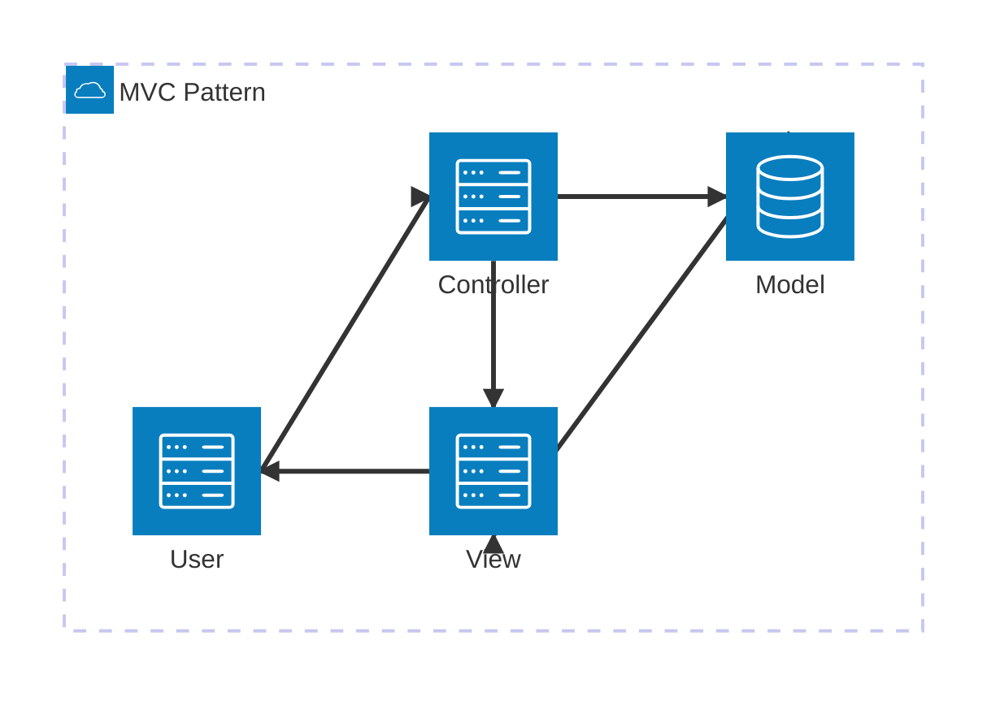
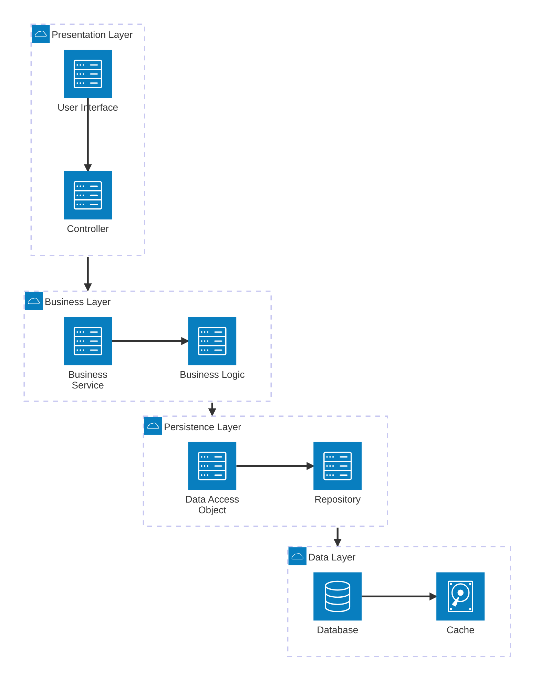
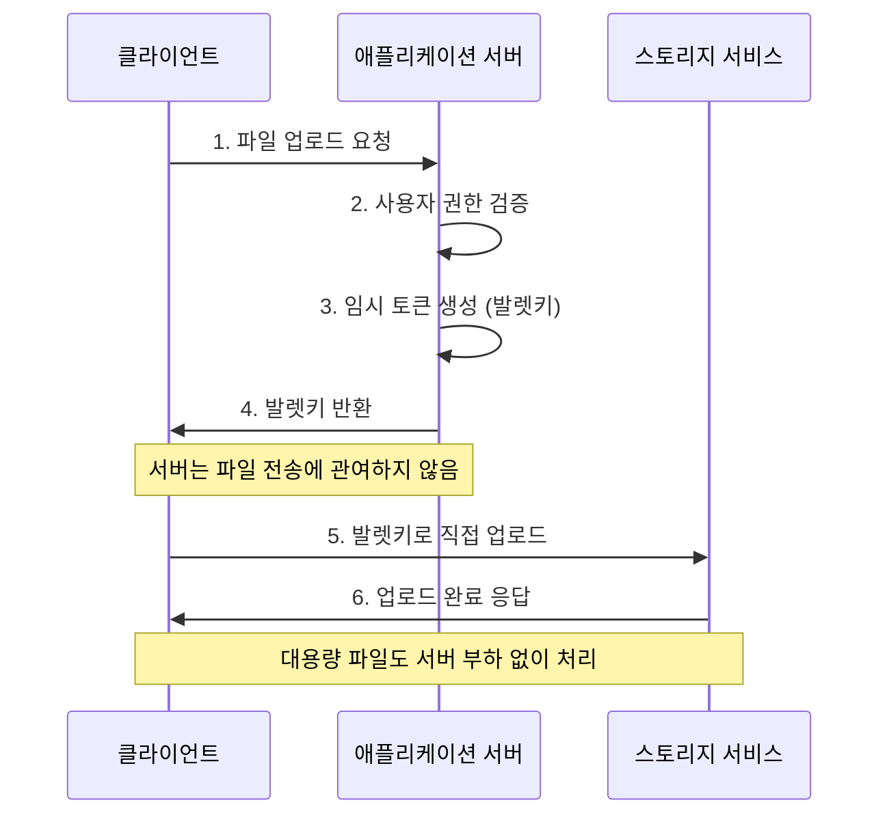
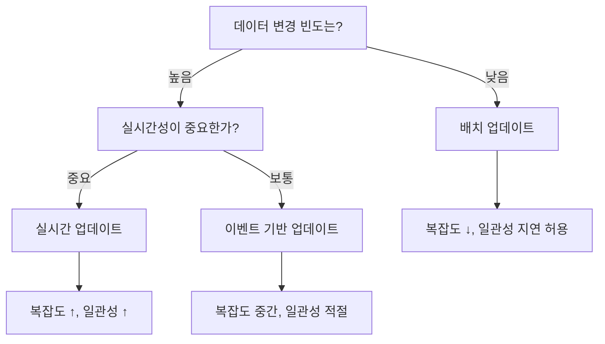
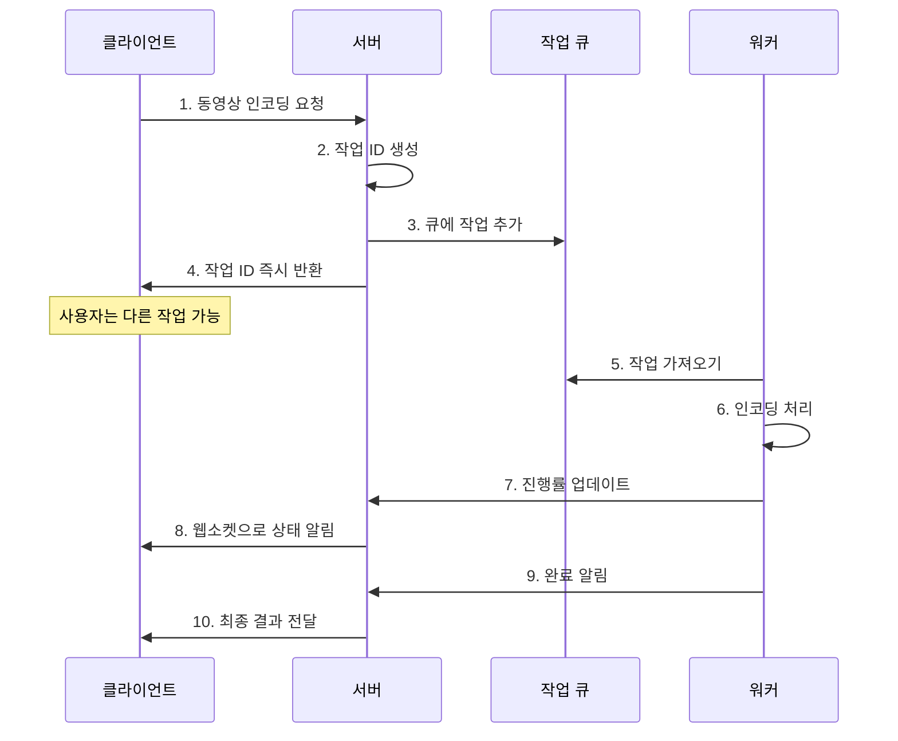

# 📚 개발 도서 스터디 템플릿

### 📌 

## 📂 2. 내용 정리 (자신의 언어로 요약)

### 🔧 MVC 패턴

### 🔧 계층형 아키텍처

## 실제 구현 예제

**디지털 가라지에서 진행한 프로젝트 예시**

이메일에 대용량 첨부파일 기능과 함께 조회 기능 성능 최적화를 위해 아래의 패턴들을 적용하였음

## 🔑 발렛키 패턴 (Valet Key Pattern)

### 📋 **패턴 개요**

| 구분 | 내용 |
|------|------|
| **목적** | 클라이언트가 리소스에 제한된 직접 접근 가능 |
| **핵심 아이디어** | 서버 중개 없이 임시 권한으로 직접 접근 |
| **대표 사례** | AWS S3 Pre-signed URL |

### 🔄 **작동 방식 플로우**

사용자가 대용량 파일 업로드할 때 우리 서버가 모든 파일을 중개하면 서버 리소스만 잡아먹고 비효율적이므로 클라이언트가 직접 업로드 할 수 있도록 하는 패턴

**🎯 문제 상황**
- 대용량 파일 업로드 시 서버 부하 증가
- 네트워크 대역폭 이중 사용 (클라이언트→서버→스토리지)
- 서버 장애 시 업로드 중단 위험

**✅ 해결 방법**
- 클라이언트에게 임시 업로드 권한 제공
- 서버 우회하여 직접 스토리지 접근
- 제한된 시간과 권한으로 보안 유지

### ⚠️ **주의사항**

| 요소 | 고려사항 | 권장사항 |
|------|----------|----------|
| **토큰 만료시간** | 너무 길면 보안 위험, 너무 짧으면 UX 저하 | 파일 크기별 차등 적용 |
| **권한 범위** | 과도한 권한 부여 시 보안 문제 | 최소 권한 원칙 적용 |
| **에러 처리** | 토큰 만료나 권한 오류 대응 | 명확한 오류 메시지 제공 |
|**보안**|직접적인 컨트롤이 어렵기에 이를 고려해야 함|

## 📊 Materialized View 패턴

### 📈 **패턴 비교표**

| 방식 | 일반 View | Materialized View |
|------|-----------|-------------------|
| **저장 방식** | 가상 테이블 (쿼리만 저장) | 실제 데이터 저장 |
| **조회 성능** | 매번 쿼리 실행으로 느림 | 미리 계산된 결과로 빠름 |
| **저장 공간** | 쿼리 정의만 저장 | 결과 데이터 저장 필요 |
| **데이터 일관성** | 항상 최신 | 업데이트 주기에 따라 지연 |
| **적용 상황** | 간단한 조회 | 복잡한 집계나 조인 |

### 🔄 **업데이트 전략 선택 가이드**

전자상거래 사이트에서 상품 검색 화면을 생각해보면, 상품 정보 + 카테고리 + 리뷰 점수 + 재고 현황을 모두 조합해서 보여줘야 함. 이걸 매번 실시간으로 계산하면 너무 느리기에 계산이 필요한 경우에는 미리 계산을 해놓자는게 핵심 아이디어

### 🕒 **업데이트 주기별 전략**

| 전략 | 업데이트 주기 | 적용 데이터 예시 | 장단점 |
|------|---------------|------------------|--------|
| **실시간** | 데이터 변경 즉시 | 재고 수량, 가격 | ✅ 일관성 보장 ❌ 시스템 복잡 |
| **이벤트 기반** | 중요 변경 시점 | 상품 등록/수정 | ✅ 균형잡힌 접근 |
| **배치** | 주기적 (시간/일단위) | 리뷰 점수, 통계 | ✅ 구현 간단 ❌ 지연 발생 |

## ⏳ 비동기 요청-회신 패턴

### 🔄 **동기 vs 비동기 비교**

| 구분 | 동기 방식 | 비동기 방식 |
|------|-----------|-------------|
| **처리 방식** | 요청 → 대기 → 응답 | 요청 → 즉시 응답 → 백그라운드 처리 |
| **사용자 경험** | 대기 시간 동안 블록킹 | 다른 작업 계속 가능 |
| **서버 리소스** | 연결 유지로 리소스 점유 | 효율적 리소스 사용 |
| **구현 복잡도** | 간단 | 상태 관리 등으로 복잡 |
| **적용 상황** | 빠른 처리 (< 5초) | 오래 걸리는 작업 (> 30초) |

### 📱 **실무 적용 플로우**

### 🎯 **상태 관리 체계**

| 상태 | 설명 | 사용자 표시 | 다음 가능 상태 |
|------|------|-------------|----------------|
| **PENDING** | 대기 중 | "처리 대기 중..." | PROCESSING, FAILED |
| **PROCESSING** | 처리 중 | "진행률 45%" | COMPLETED, FAILED |
| **COMPLETED** | 완료 | "완료! 결과 확인" | - |
| **FAILED** | 실패 | "오류 발생, 재시도 가능" | PENDING (재시도) |
| **CANCELLED** | 취소됨 | "사용자가 취소함" | - |

**이점**
- 진행률이나 예상 완료 시간 제공해서 기다리는 동안 답답하지 않게 함
- 작업 취소 기능도 제공하면 사용자 만족도 높아짐

### 🎪 **패턴 조합 활용법**

이런 패턴들을 단독으로 쓰기보다는 조합해서 쓰면 더 효과적임:

| 조합 | 시나리오 | 효과 |
|------|----------|------|
| **발렛키 + 비동기** | 대용량 파일 업로드 후 처리 | 업로드 속도 ↑ + 처리 안정성 ↑ |
| **Materialized View + 비동기** | 복잡한 리포트 생성 | 조회 성능 ↑ + 생성 작업 안정성 ↑ |
| **3개 패턴 모두** | 종합 데이터 분석 플랫폼 | 전체적인 시스템 효율성 극대화 |

## 💬 3. 이야기하고 싶은 질문 / 포인트

- 💭 포인트: 하나의 패턴만을 고집하기보다는 여러패턴을 적재적소에 사용할 수 있다면 최고일 것 같다. 

---

## 🎯 4. 정리 & 적용 아이디어

- **내가 배운 것 한 줄 요약**:  
  → `여러가지 패턴에 대해 알 수 있었으며 이에 대한 중요성 또한 깨달을 수 있었다.`