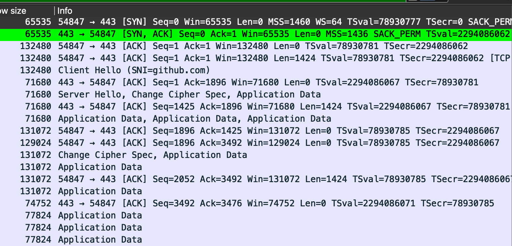

# 📚 개발 도서 스터디 템플릿

## 🧠 1. 책을 읽기 전에

- **알고 싶은 개념 / 주제**: 연결 관련 문제가 발생하였을 때 OSI 3계층 부터 어디를 어떻게 보면 좋을까?

---

## 📂 2. 내용 정리 (자신의 언어로 요약)

### 📌 4계층 관점에서의 연결

#### TCP 서버의 두 가지 큐

##### 1. SYN Backlog (Half-Open Connection Queue)
- **상태**: SYN_RECEIVED
- **시점**: 서버가 SYN-ACK를 보낸 후, 클라이언트의 ACK를 기다리는 중
- **내용**: 아직 완료되지 않은 연결들 (half-open connections)

##### 2. Accept Queue (Full Connection Queue)
- **상태**: ESTABLISHED
- **시점**: 3-way handshake 완료 후, `accept()` 시스템 콜을 기다리는 중
- **내용**: 완전히 연결된 소켓들

##### 전체 흐름

```
클라이언트 → 서버: SYN
                   ↓
            [SYN Backlog에 추가]
                   ↓
서버 → 클라이언트: SYN-ACK
                   ↓
클라이언트 → 서버: ACK
                   ↓
        [SYN Backlog에서 제거]
                   ↓
        [Accept Queue에 추가]
                   ↓
          accept() 시스템 콜
                   ↓
        [Accept Queue에서 제거]
                   ↓
            애플리케이션 처리
```

##### 연결 관련 서버 파라미터

```bash
[azureuser@simple-vm ~]$ ss -tulnp
Netid    State      Recv-Q     Send-Q         Local Address:Port         Peer Address:Port    Process    
udp      UNCONN     0          0                  127.0.0.1:323               0.0.0.0:*                  
udp      UNCONN     0          0                      [::1]:323                  [::]:*                  
tcp      LISTEN     0          128                  0.0.0.0:22                0.0.0.0:*                  
tcp      LISTEN     0          511                  0.0.0.0:80                0.0.0.0:*                  
tcp      LISTEN     0          128                     [::]:22                   [::]:*                  
tcp      LISTEN     0          511                     [::]:80                   [::]:*  
```
**Listen 상태일 때**
Recv-Q: 현재 accept queue에 대기 중인 연결 수
Send-Q: accept queue 최대 크기 (somaxconn 값)

**Established 상태일 때**
Recv-Q: 커널 버퍼에서 애플리케이션이 읽지 않은 데이터 크기
Send-Q: 전송 대기 중인 데이터 크기

##### 실제 사례
서비스를 Azure 환경으로 옮기면서 커넥션 개수를 파악이 필요한 일이 있었음
`watch -n 5 "ss -tunp state established"` 
keep alive 특성이 있었기에 이렇게만 해도 현재 어떤한 연결이 진행 중인지를 알 수 있었음

그러나...
keep alive가 없는 경우에는 너무나도 빠르게 연결이 완료처리가 되서 위 명령어로도 잡히지 않았거나 보기가 불편하였음
그러한 경우에는 `tcpdump` 또는 어플리케이션의 로그를 통해서 캡처를 해야함

**💡 알게 된 점**: 소켓 레벨에서의 타임아웃과 어플리케이션 레벨에서의 타임아웃은 다르기에 주의가 필요


### 📌 재시도

재시도는 중요하지만 주의가 필요하다.

1. **멱등성**: 같은 요청을 여러 번 보내도 결과가 동일해야 함
2. **서버 부하**: 재시도를 무작정 실행하게 된다면 서버에 부하가 간다.(1번 처리할게 2번,3번 요청이 날라오게 되니...)
3. **지수 백오프**: 재시도 간격을 점진적으로 늘려 서버 부하 방지
4. **Circuit Breaker**: 연속 실패 시 일정 시간 요청 차단
- > 재시도의 경우 동기를 처리하기 보다는 비동기로 처리하는 것이 좋아 보인다.


#### 재시도시 멱등성 해결 방안

**질문: 재시도의 경우 멱등성을 어떻게 해결할까?**

일단 멱등성이란?

**여러 차례 적용해도 결과를 변경시키지 않는 작업**


카프카의 경우 Process ID와 Sequence Number를 조합하여 멱등성을 달성
이 아이디어를 이용하면 멱등성을 달성 할 수 있을 것 같다.

Http 통신에서 GET,PUT,DELETE 의 경우에는 멱등성이 보장되지만 POST,PATCH에서는 보장 되지 않음
이를 위해 UUID와 같은 유니크한 값을 서버로 넘겨줘야 한다.


### 📌 Http connection pool



간단하게 github에 접속을 하는 경우 어떠한 과정을 거치는지에 대한 것을 와이어 샤크로 캡처한 사진

Change Cipher Spec까지 거쳐야 비로소 통신이 가능하게 된다.(반대로 끊는 과정도 길다...)

만약 커넥션 풀을 사용한다면 이러한 과정을 재사용이 가능하기에 그 이점이 크다.(서비스에 따라 내부 통신에서는 SSL을 제거하고 하는 경우도 많은 것 같음)

---

## 💬 3. 이야기하고 싶은 질문 / 포인트

> 읽으며 생긴 **의문**, **확인하고 싶은 개념**, **비판하고 싶은 주장** 등을 적습니다.

- ❓ 질문 1: Toss 글에서는 클라인언트가 UUID를 발급해서 보내주고 있는데 보안적으로 문제가 없는지?
-> 중간에 가로채서 해당 키를 수정하거나 하는 경우 문제가 될 것 같은데... 
[TOSS - 멱등성이-뭔가요](https://docs.tosspayments.com/blog/what-is-idempotency)

- 💭 더 알아보고 싶은 개념: 최근에는 TCP방식이 아닌 UDP를 이용한 http 통신을 하고 있는데 이러한 경우에도 커넥션 풀이 잘 동작하는지? 동작한다면 어떠한 원리를 가지고 있기에 커넥션 풀을 이용할 수 있는 건지(구글 Quic 프로토콜)

---

## 🎯 4. 정리 & 적용 아이디어

- **내가 배운 것 한 줄 요약**:  
  → `이 장을 통해 나는 외부연동에 대해 고려해야 할 점들을 이해했다.`
