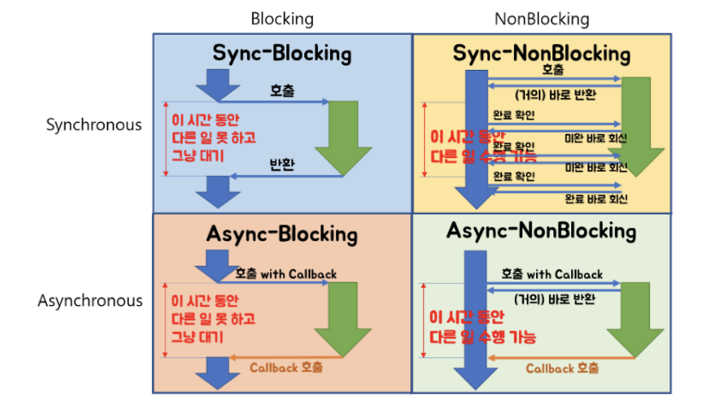
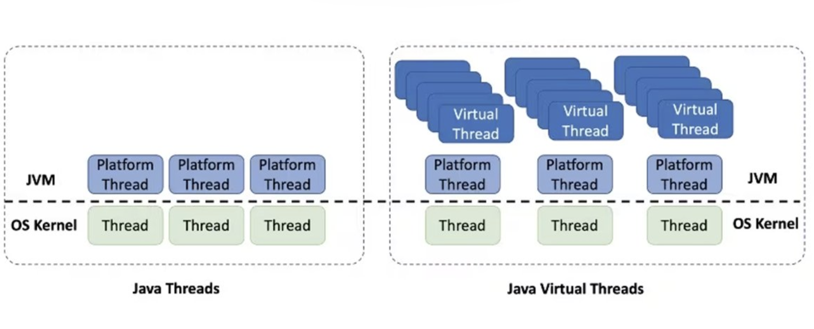

# 📚 개발 도서 스터디 템플릿

## 🧠 1. 책을 읽기 전에

- **알고 싶은 개념 / 주제**: 동기/비동기 연동 방식과 각각의 장단점, 그리고 실제 구현 시 고려사항들

---

## 📂 2. 내용 정리 (자신의 언어로 요약)

### 📌 동기 연동과 비동기 연동

#### 개념 구분
- **동기 vs 비동기**: 호출자가 결과를 기다리는지 여부
- **Blocking vs Non-Blocking**: 호출된 함수가 제어권을 바로 반환하는지 여부

#### 동기 연동의 특징
- 요청 후 응답을 받을 때까지 대기
- 구현이 간단하고 직관적
- 응답 시간이 길어지면 전체 성능에 영향

#### 비동기 연동의 특징
- 요청 후 다른 작업 수행 가능
- 복잡한 예외 처리와 상태 관리 필요



### 📌 별도 스레드로 실행하기

#### 스레드 풀 (Thread Pool)
- **배경**: 스레드 하나당 약 1MB 메모리 사용
- **목적**: 스레드 생성/소멸 비용 절약 및 재활용
- **구조**: 미리 생성된 스레드들을 풀에서 관리하여 작업 할당

주의 할 점으로는 state full 하게 사용하면 안 된다는 점...

#### Virtual Thread (가상 스레드)
- **기존 모델**: OS Thread와 1:1 매핑
- **Virtual Thread**: OS Thread(캐리어 스레드)와 1:N 매핑
- **장점**: 
  - 더 적은 메모리 사용량
  - 더 많은 동시 처리 가능
  - 기존 코드와 호환성 유지




참고 하며 좋은 글

[[Project Loom] Virtual Thread에 봄(Spring)은 왔는가 - kakaopay](https://tech.kakaopay.com/post/ro-spring-virtual-thread/)

### 📌 트랜잭션 아웃박스 패턴 (Transactional Outbox Pattern)

#### 패턴 설명
```
1. 비즈니스 데이터와 이벤트 데이터를 동일한 트랜잭션에서 저장
   ┌─────────────────┐    ┌─────────────────┐
   │   Business      │    │   Outbox        │
   │   Table         │    │   Table         │
   │                 │    │                 │
   │ - id            │    │ - event_id      │
   │ - data          │    │ - event_type    │
   │ - status        │    │ - payload       │
   └─────────────────┘    │ - created_at    │
                          │ - processed     │
                          └─────────────────┘

2. 별도 프로세스가 Outbox 테이블을 읽어서 메시지 발송
3. 발송 완료 후 processed 플래그 업데이트
```

#### 기존 방식의 문제점
```
DB 저장 → 메시지 발송
    ↓         ↓
   성공    실패 시 불일치 발생
```

#### 아웃박스 패턴의 장점
- **일관성**: 하나의 트랜잭션 내에서 처리하여 원자성 보장
- **안정성**: 메시지 발송 실패 시에도 재처리 가능
- **순서 보장**: 이벤트 발생 순서대로 처리 가능

#### 실제 적용 사례
> 현재 맡고 있는 서비스에서도 메시지 발송 시 별도 테이블에 저장하고, C 프로세스가 읽어서 처리하는 방식으로 구현되어 있음


---

## 💬 3. 이야기하고 싶은 질문 / 포인트

- ❓ **질문 1**: Virtual Thread가 기존 Thread Pool 방식보다 항상 좋은가? 어떤 상황에서는 기존 방식이 더 적합할까?
=> cpu 집약적인 방식에서는 효과적이나 i/o작업에서는 좋지 않다...

- ❓ **질문 2**: 글로벌 트랜잭션을 구현하는 방법
=> JTA (Java Transaction API)를 사용한다고 하는데...

- 📝 **아쉬운 점**: 책에서 동기/비동기와 Blocking/Non-Blocking 개념을 명확히 구분하지 않고 설명한 부분

---

## 🎯 4. 정리 & 적용 아이디어

- **내가 배운 것 한 줄 요약**:  
  → `비동기 처리와 안정적인 외부 연동을 위해서는 적절한 스레드 관리와 트랜잭션 아웃박스 패턴 같은 설계 패턴이 중요하다.`